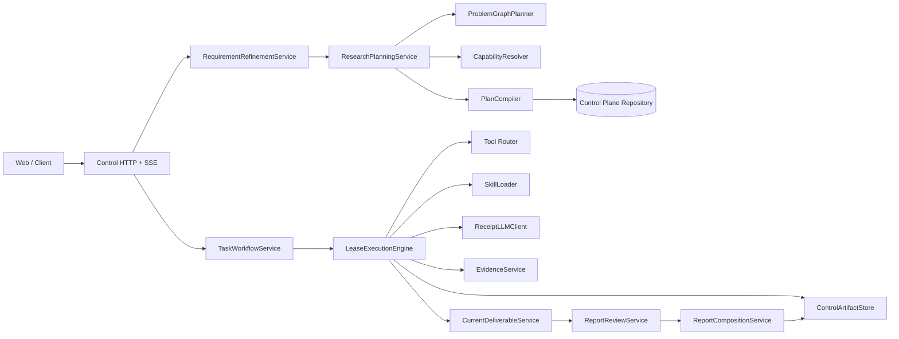
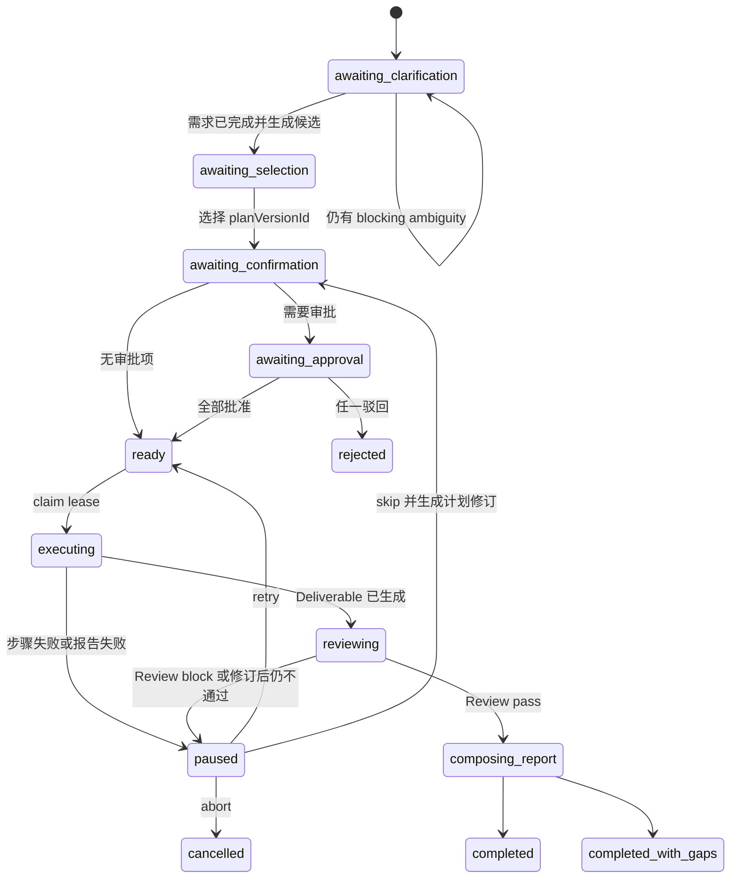
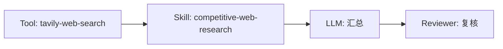

# 研究任务编排与 Skill 调用迁移指南

> 文档基线：2026-08-19 当前工作区实现。当前工作区包含尚未全部进入远端 `main` 的 Control flow 改动，迁移时应以本文列出的接口和不变量为准，不要按单个 commit 机械复制。
>
> 目标读者：需要把“用户输入分析、需求澄清、任务规划、Skill 调用、任务编排、内容总结、报告生成”迁移到另一个项目的工程团队。

## 1. 这条链路解决什么问题

系统接收一段自然语言研究需求，将其转换为有状态、可审计、可恢复的研究执行任务。完整链路如下：

```text
用户输入
  -> ResearchTaskV2 需求理解
  -> 必要时需求澄清
  -> ProblemGraph 研究问题图
  -> CapabilityResolution 能力筛选
  -> depth / speed 两份候选计划
  -> PlanCompiler 冻结 Execution DAG
  -> 用户选择、确认、审批
  -> LeaseExecutionEngine 执行 Tool / Skill / LLM / Reviewer
  -> SEALED Step Artifacts
  -> Evidence Manifest
  -> Research Deliverable
  -> Report Review
  -> ReportDocument 与 Report Package
  -> Web 展示与导出
```

这条链路包含两张不同的图，迁移时不要合并：

- **ProblemGraph** 描述“研究必须回答哪些问题、问题之间有什么依赖、每个问题需要什么证据”。
- **Execution DAG** 描述“为了回答这些问题，需要按什么顺序调用 Tool、Skill、LLM 和 Reviewer”。

ProblemGraph 是研究语义，Execution DAG 是运行控制。前者变化时通常要重新规划，后者执行时必须保持冻结。

## 2. 总体架构



### 2.1 可迁移的深 Module

| Module | 对外 Interface | 隐藏的实现复杂度 |
|---|---|---|
| `RequirementRefinementService` | 原始输入或澄清答案 -> `ResearchTaskV2` | 会话上下文、结构化生成、版本激活、重复请求恢复 |
| `ResearchPlanningService` | finalized requirement -> ProblemGraph、能力决策、候选计划 | 决策节点、知识召回、能力筛选、候选修复 |
| `PlanCompiler` | 候选计划 -> 冻结计划与待补输入 | DAG、问题覆盖、Tool 前置、输入绑定、审批、Evidence Policy |
| `TaskWorkflowService` | select / confirm / approve / revise / execute / resume | 状态机、CAS、幂等命令、审批、执行 lease |
| `LeaseExecutionEngine` | lease + frozen plan -> execution result | wave 调度、Actor 执行、Artifact、失败隔离、证据与报告 |
| `CurrentDeliverableService` | verified outputs + Evidence -> Deliverable | 摘要生成、FindingGraph、payload schema、覆盖校验 |
| `ReportReviewService` | Deliverable -> pass / revise / block | 确定性检查、语义复核、一次修订 |
| `ControlArtifactStore` | write / read verified Artifact | 路径隔离、哈希、SEALED 状态、二进制校验 |

### 2.2 需要替换的 Adapter

迁移到其他项目时，以下实现通常不能直接复用，但其 Interface 应保留：

- LLM Adapter：模型供应商、鉴权、模型路由和回执存储。
- Tool Adapter：搜索、内部接口、实验室或 MCP 的调用方式。
- Repository Adapter：PostgreSQL、其他数据库或事件存储。
- Artifact Adapter：本地文件、对象存储或数据库大字段。
- Auth Adapter：JWT、SSO 或内部身份系统。
- Web Adapter：React、其他前端框架或纯接口调用方。

## 3. 端到端状态机



选择、澄清、确认、审批、修订、执行和恢复命令带 `expectedVersion` 和 `Idempotency-Key`。新建规划负责创建 task 和 conversation，不复用这些命令键。Repository 对后续命令使用比较并交换更新状态，防止两个请求同时推进同一任务。

## 4. 阶段一：分析用户输入并生成需求澄清

### 4.1 HTTP 入口

主要入口：

```text
POST /api/control-tasks/plan
POST /api/control-tasks/plan/stream
POST /api/control-tasks/:id/clarify
```

SSE 入口返回四类事件：

```text
conversation
progress
result
error
```

相关文件：

- `apps/agent-api/src/server.ts`
- `apps/agent-api/src/routes/control-planning.ts`
- `apps/agent-api/src/routes/control-tasks.ts`

### 4.2 先创建任务壳，再理解需求

新请求进入后，服务端先创建：

```text
control_tasks(state=awaiting_clarification)
```

然后调用 `RequirementRefinementService.understand()`。如果需求理解或后续规划失败，这个未完成任务会转为 `failed`，不会遗留一个看似仍可继续的空任务。

### 4.3 ResearchTaskV2 是需求真相源

需求理解的输出不是自由文本，而是 `ResearchTaskV2`：

```ts
interface ResearchTaskV2 {
  version: 'research-task-v2';
  task_type:
    | 'competitive_research'
    | 'user_research_planning'
    | 'voc_diagnosis'
    | 'design_audit'
    | 'a11y_audit';
  business_domain: string;
  research_goal: string;
  target_audience: string[];
  scope: string[];
  constraints: Array<{ id: string; statement: string; source: 'user' | 'policy' }>;
  success_criteria: Array<{ id: string; statement: string }>;
  expected_deliverables: string[];
  assumptions: Array<{ key: string; value: string; editable: boolean }>;
  ambiguities: Array<{ id: string; statement: string; blocking: boolean }>;
  clarification_questions: Array<{ key: string; question: string; rationale: string }>;
  blocking_issues: Array<{ key: string; reason: string; kind: string }>;
  sensitivity: 'public' | 'internal' | 'confidential';
  pii_detected: boolean;
}
```

生成后依次执行：

1. JSON Schema 校验。
2. `expected_deliverables` 按 Deliverable Registry 归一化。
3. 创建 `control_requirement_versions` 版本。
4. 将该版本激活到 task。
5. 写入模型调用回执。

### 4.4 什么时候需要澄清

当前实现只把 `ambiguities[].blocking === true` 视为必须澄清。非阻断 ambiguity 和 clarification question 可以保留在需求中，但不会阻止进入规划。

迁移时可以修改这条策略，但必须集中在一个函数中，比如：

```ts
function needsClarification(requirement: ResearchTaskV2): boolean {
  return requirement.ambiguities.some(item => item.blocking);
}
```

不要在前端、路由和 Planner 中分别判断。

### 4.5 澄清后的处理

客户端只提交：

```ts
{
  expectedVersion,
  clarificationAnswers,
  assumptionEdits,
  idempotencyKey
}
```

客户端不能提交 `structuredTask`、plan 或 planHash。服务端重新读取会话记录和 active requirement，生成新版本并激活。相同请求通过命令预留和 request hash 保证幂等。

## 5. 阶段二：从研究问题生成任务清单

### 5.1 先选 Deliverable 和 Evidence Policy

`resolvePlanningDeliverableSelection()` 根据 `task_type` 和 `expected_deliverables` 选择：

- Deliverable 类型。
- payload schema。
- synthesis prompt。
- review rubric。
- report template。
- Evidence Policy。

配置文件：

```text
orchestrator/deliverable-registry.yaml
orchestrator/evidence-policy.yaml
orchestrator/prompts/deliverables/*.md
orchestrator/report-rubrics/*.yaml
orchestrator/report-templates/*.yaml
schemas/deliverables/*.schema.json
```

Deliverable 与证据策略必须先冻结，再生成 ProblemGraph 和执行计划。不要让候选计划自己决定交付物或证据标准。

### 5.2 激活决策节点并召回方法知识

`RoutedPlanner.planCurrent()` 读取：

```text
orchestrator/decision-graph.yaml
```

按 `task_type` 激活节点，例如研究目标、方法选择、敏感数据、竞品参照和输出标准。每个节点的 `related_tags` 用于从知识库召回方法卡片。

决策节点是完备性检查项，不是执行步骤。LLM 对节点做状态判断，状态结果参与计划上下文，但不会直接成为 Tool 或 Skill 调用。

### 5.3 ProblemGraph 描述研究问题

`ProblemGraphPlanner` 把 finalized requirement 转成问题图：

```ts
interface ResearchQuestion {
  id: string;
  statement: string;
  rationale: string;
  priority: 'required' | 'optional';
  success_criterion_ids: string[];
  evidence_requirements: EvidenceRequirement[];
  acceptance_criteria: string[];
  depends_on: string[];
}

interface ProblemGraph {
  version: 'problem-graph-v1';
  questions: ResearchQuestion[];
}
```

校验内容包括：

- question id 唯一。
- 依赖存在且无环。
- required question 覆盖 success criteria。
- 每个 required question 有 required evidence。
- 全局 Evidence Policy 被至少一个 required question 精确覆盖。

证据错误允许一次受限重生成，其他结构错误直接失败。

### 5.4 CapabilityResolver 先筛选，再让模型选择

Skill 不会被 LLM 从全仓库自由猜测。`CapabilityResolver` 先按确定性条件得到 eligible shortlist：

1. Skill 必须为 `active`。
2. `task_types` 必须包含当前 task type。
3. 所有 `required_tools` 必须注册且 active。
4. core Tool 必须解析到真实 Adapter。
5. high-risk Skill 或 Tool 必须有可用审批角色。
6. 缺少的输入角色转成 `pending_inputs`。

输出分为：

```ts
interface CapabilityResolution {
  eligible: CapabilityDecision[];
  rejected: CapabilityDecision[];
}
```

候选计划生成只能看到 eligible Skill 和它们依赖的 Tool。PlanCompiler 会再次拒绝 rejected 或未知能力。

### 5.5 生成 depth 和 speed 两份候选

LLM 基于以下上下文生成两份候选：

- finalized `ResearchTaskV2`
- ProblemGraph
- CapabilityResolution
- eligible Skill 的输入输出摘要
- required Tool 及 input schema
- 方法知识
- Evidence requirements

约束：

- `depth` 最多 8 步。
- `speed` 最多 4 步。
- Skill 的 required Tool 必须成为更早的 Tool step。
- LLM step 只输出 `/text`。
- Reviewer step 只输出 `/review`。
- Skill 输出必须位于 `/payload`。
- 当前执行器不接受 `fallback_actor_ids`。
- optional Tool 不能成为关键输入绑定来源。

候选第一次未通过编译时，完整 Compiler 反馈会返回模型修复一次。修复后仍失败则终止规划。

### 5.6 PlanCompiler 把候选变成冻结 DAG

`PlanCompiler.compile()` 是任务清单进入执行前的最后门禁。它校验：

- 候选字段和 step 字段精确匹配 schema。
- `depends_on` 无环且只能指向更早步骤。
- required research question 至少被一个 step 覆盖。
- actor 位于 eligible capability 集合。
- Skill 的 required Tool 已经排在前面。
- input binding 只能读取已声明的 expected output。
- input binding 的 target pointer 必须已存在于 step.input。
- high-risk 能力带正确审批角色。
- pending input 能映射到明确步骤和字段。
- Evidence Policy 与冻结 Deliverable 一致。

冻结后的计划结构：

```ts
interface CurrentPlanStep {
  step_no: number;
  step_name: string;
  actor_type: 'tool' | 'skill' | 'llm' | 'reviewer';
  actor_id: string;
  question_ids: string[];
  depends_on: number[];
  input: Record<string, unknown>;
  input_bindings: Array<{
    target_pointer: string;
    source_step_no: number;
    source_pointer: string;
  }>;
  expected_outputs: Array<{ pointer: string; description: string }>;
  acceptance_criteria: string[];
  requires_approval: boolean;
  approval_role?: 'owner' | 'legal' | 'security';
  fallback_actor_ids: string[];
}
```

```ts
interface CurrentExecutionPlan {
  task_id: string;
  deliverable_type: string;
  evidence_requirements: EvidenceRequirement[];
  problem_graph: ProblemGraph;
  problem_graph_provenance: ProblemGraphProvenance;
  capability_decisions: CurrentCapabilityDecisions;
  steps: CurrentPlanStep[];
  candidate_metadata: {
    title: string;
    rationale: string;
    tradeoffs: string;
  };
  activated_nodes: string[];
}
```

Repository 在写入时注入真实 task id，按 canonical JSON 计算 plan hash，并原子保存 depth 和 speed 两个不可变版本。

## 6. Skill 调用机制

这是迁移时最需要保留的部分。

### 6.1 Skill 的三个加载层级

`SkillLoader` 使用渐进加载：

| 层级 | 加载内容 | 使用阶段 |
|---|---|---|
| 轻量索引 | id、name、when_to_use、task_types、inputs、outputs、required_tools | 能力筛选和计划生成 |
| Skill 正文 | 命中的 `SKILL.md` 全文 | 执行该 Skill 时 |
| 执行合同 | input schema、统一 output envelope、领域 payload schema | 执行前后校验 |

规划阶段不要把所有 `SKILL.md` 全文放进模型上下文。候选确定后，执行期只加载命中的 Skill 正文。

### 6.2 Skill Registry

一个可执行 Skill 至少需要：

```yaml
- id: digital-human-competitive-analysis
  name: 数字人竞品分析
  path: skills/competitive-analysis/digital-human/SKILL.md
  when_to_use: 用户需要分析数字人、虚拟主播、直播竞品时使用
  status: active
  task_types: [competitive_research, user_research_planning]
  inputs: [business_domain]
  outputs: [competitive_analysis]
  input_schema: skills/competitive-analysis/digital-human/input.schema.json
  output_schema: schemas/skill-result-envelope.schema.json
  payload_schema: skills/competitive-analysis/digital-human/output.schema.json
  required_tools:
    - tavily-web-search
    - ai-spider-search
    - experience-model-lab
    - virtual-user-lab
  cost_level: medium
  risk_level: low
```

字段含义：

- `when_to_use` 供计划模型理解能力边界。
- `task_types` 是确定性第一层过滤。
- `inputs` 用于判断是否存在待补输入。
- `visual_inputs` 和 `multiple_visual_inputs` 描述图片输入。
- `required_tools` 决定 Tool step 必须在 Skill step 前出现。
- `output_schema` 是统一信封。
- `payload_schema` 是领域结果，运行时会内联到信封的 `/payload`。
- `risk_level` 决定是否需要审批。

### 6.3 required Tool 的注册

Skill Registry 的 `required_tools` 只能引用 Tool Registry 中的 id。Tool Registry 保存轻量索引，执行细节放在独立 manifest：

```yaml
# orchestrator/tool-registry.yaml
- id: tavily-web-search
  name: Tavily 网页检索
  path: tools/tavily-web-search/manifest.yaml
  adapter_type: tavily
  status: active
  tier: core
```

```yaml
# tools/tavily-web-search/manifest.yaml
id: tavily-web-search
name: Tavily 网页检索
adapter_type: tavily
entrypoint: /search
base_url_env: TAVILY_BASE_URL
auth_required: true
risk_level: low
approver_rule: none
timeout_seconds: 30
retry_policy:
  max_attempts: 2
  backoff_seconds: 3
input_schema: tools/tavily-web-search/input.schema.json
output_schema: tools/tavily-web-search/output.schema.json
redaction_policy:
  pii: mask
  sensitive_business_data: block
```

`ToolRouter.resolve()` 必须返回实际 Adapter 身份。core Tool 只有在 `executionMode=real`、声明类型与解析类型一致、`implementationId` 已知时才算可用。

### 6.4 Skill 不直接调用 Tool

当前生产链的关键约束：**Skill 执行器不会在 Skill 内部发起 Tool 调用。**

Tool 调用在计划中是独立 step：



`required_tools` 只表达依赖。Planner 负责把依赖展开成 Tool step，PlanCompiler 负责检查 Tool 是否存在且顺序正确，ExecutionEngine 负责真正调用。

迁移时不要实现成：

```text
SkillRunner -> 在内部随意调用任意 Tool
```

否则计划无法审计，审批、重试、并发、Evidence 和 Artifact 都会绕过控制面。

### 6.5 Tool 输出如何进入 Skill

有两条数据通道：

**prior_outputs**，Skill 能看到其依赖步骤和 input binding 来源步骤的已验证输出。输出先从 SEALED Artifact 读取并校验 hash，再进入 LLM 上下文。

**input_bindings**，把前序输出的 JSON Pointer 写入当前 Skill 的 `step.input`：

```json
{
  "target_pointer": "/public_sources",
  "source_step_no": 1,
  "source_pointer": "/results"
}
```

运行时步骤：

1. 找到 source step 的 output Artifact。
2. 要求 source step 状态为 `succeeded`。
3. 要求 Artifact 为 `SEALED`，hash 与数据库一致。
4. 读取 `source_pointer`。
5. 将值写入当前 step.input 的 `target_pointer`。
6. 校验 Skill input schema。

`target_pointer` 是相对于 `step.input` 的路径，不能写成 `/input/public_sources`。

下面是 Tool 到 Skill 的最小 Execution DAG 示意：

```json
[
  {
    "step_no": 1,
    "step_name": "检索公开资料",
    "actor_type": "tool",
    "actor_id": "tavily-web-search",
    "question_ids": ["Q1"],
    "depends_on": [],
    "input": { "query": "目标市场" },
    "input_bindings": [],
    "expected_outputs": [
      { "pointer": "/results", "description": "检索结果" }
    ],
    "acceptance_criteria": ["至少返回一个可复查来源"],
    "requires_approval": false,
    "fallback_actor_ids": []
  },
  {
    "step_no": 2,
    "step_name": "执行研究分析",
    "actor_type": "skill",
    "actor_id": "example-research-skill",
    "question_ids": ["Q1"],
    "depends_on": [1],
    "input": { "research_goal": "比较目标市场", "public_sources": [] },
    "input_bindings": [
      {
        "target_pointer": "/public_sources",
        "source_step_no": 1,
        "source_pointer": "/results"
      }
    ],
    "expected_outputs": [
      { "pointer": "/payload", "description": "结构化分析结果" }
    ],
    "acceptance_criteria": ["事实均可反查来源"],
    "requires_approval": false,
    "fallback_actor_ids": []
  }
]
```

### 6.6 Skill 的运行时调用

生产路径位于 `LeaseExecutionEngine.runSkill()`，不是旧的 `runners/skill-runner.ts`。

调用上下文：

```ts
const skillContext = {
  research_goal,
  input: compactLlmInput(resolvedInput),
  prior_outputs: verifiedPriorOutputs(outputs, step),
  question_ids: step.question_ids,
  acceptance_criteria: step.acceptance_criteria,
  expected_outputs: step.expected_outputs,
  actor_type: step.actor_type,
  actor_id: step.actor_id,
};
```

Prompt 结构：

```text
Execute this Skill workflow using only supplied outputs.
<step contract JSON>

<完整 SKILL.md>
```

然后调用：

```ts
llm.generateStructured({
  prompt,
  schema: effectiveSkillOutputSchema,
  schemaName: `skill:${skillId}`,
  context: skillContext,
  receipt: {
    stage: 'skill',
    attemptId,
    stepNo,
    contextManifestHash,
    expectedModel,
  },
});
```

输出必须通过统一 envelope 与 payload schema。成功后保存为：

```text
kind: skill_output
schemaVersion: skill-output-v2
logical output root: /payload
```

### 6.7 Skill 溯源

每次 Skill 执行记录：

- Skill body hash
- input schema hash
- output schema hash
- payload schema hash
- resolved input hash
- redacted output hash
- prompt hash
- trace id
- model receipt id
- output Artifact id

迁移后至少保留 body、schema、input、output 和模型回执五类 hash，否则无法判断重试是否仍在执行同一能力合同。

### 6.8 `$skill` 直呼

输入符合以下格式时进入直呼：

```text
$competitive-app-analysis 结合三张截图做竞品分析
```

解析规则：

```ts
/^\s*\$([A-Za-z][\w-]*)\s*([\s\S]*)$/
```

直呼会跳过自动 Skill 排序，但不会绕过：

- Skill active 校验。
- task type 匹配。
- required Tool 健康检查。
- 审批要求。
- ProblemGraph。
- PlanCompiler。
- input/output schema。
- Artifact 和 Evidence 校验。

直呼计划会自动生成两份候选：depth 增加 Reviewer，speed 只执行 required Tool 和指定 Skill。

### 6.9 SKILL.md 的写法

Skill 正文应写清能力边界、输入、执行步骤、输出和合规要求。可以提到需要哪些 Tool，但不要假设 Skill 执行器会在正文中自动获得 Tool 权限。`required_tools` 和 Execution DAG 才是实际调用依据。

```markdown
---
name: example-research-skill
description: 该 Skill 解决的问题
when_to_use: 触发条件、反例和与其他 Skill 的边界
owner: research-team
---

# Example Research Skill

## 输入
- research_goal
- source_materials

## 执行步骤
1. 明确研究问题。
2. 读取已提供的 verified prior outputs。
3. 按指定方法完成分析。
4. 区分事实、推断和缺口。

## 产出
- 结构化 payload 字段说明。
- 每类结论的证据要求。

## 边界与合规
- 不补造来源。
- 缺少输入时返回数据补充请求。
- 敏感数据只在获批范围内处理。
```

正文中的流程是模型执行说明，input/output schema 才是机器门禁。两者冲突时执行应失败，不应在运行时猜测字段。

## 7. 执行编排

### 7.1 执行前门禁

`TaskWorkflowService.execute()` 只接受：

```ts
{
  taskId,
  planVersionId,
  expectedVersion,
  idempotencyKey,
  actor
}
```

执行前要求：

- actor 是 task owner。
- planVersionId 是 active plan。
- task 为 `ready`。
- confirmation、pending input 和 approval 已满足。
- claim execution 成功并取得 lease。

### 7.2 Lease

Lease 将 task、plan、attempt 和 worker 绑定。执行期间定时 heartbeat，每次关键写入前重新确认 active lease。失去 lease 后禁止继续写 Step Artifact、Deliverable 或 Report。

建议迁移保留以下 Interface：

```ts
interface ExecutionLease {
  taskId: string;
  planVersionId: string;
  attemptId: string;
  leaseOwner: string;
  leaseToken: string;
}
```

### 7.3 Wave 调度

`ExecutionScheduler` 根据 `depends_on` 生成 wave。生产 Engine 先用 Scheduler 校验 DAG 并计算 wave，再自行通过 `Promise.allSettled` 执行每个 wave：

```text
wave 1: [1, 2]
wave 2: [3]
wave 3: [4, 5]
```

调度规则：

- 未完成依赖的步骤不能进入后续 wave。
- 无可运行步骤且仍有未完成步骤，判定为 cycle。
- 通用 Scheduler 支持 checkpoint、reused、blocked 和 cancelled 状态。
- 生产 Engine 当前主要使用 Scheduler 计算 wave，运行期失败由 Engine 处理：core 失败会暂停并停止后续 wave，optional Tool 失败通常转成 skipped gap 后继续。

### 7.4 单步生命周期

每个 step 执行：

```text
record running
  -> resolve input bindings
  -> dispatch actor
  -> sanitize output
  -> write STAGING Artifact
  -> seal Artifact with hash
  -> read back and verify
  -> record succeeded + provenance
```

错误路径：

```text
catch error
  -> invalidate unpublished Artifact
  -> classify failure
  -> record failed or skipped
  -> pause task or continue with gap
```

### 7.5 Actor 分发

```ts
switch (step.actor_type) {
  case 'tool': return runTool(...);
  case 'skill': return runSkill(...);
  case 'llm': return runLlm(...);
  case 'reviewer': return runReviewer(...);
}
```

| Actor | 输入 | 输出 |
|---|---|---|
| Tool | resolved step.input + Tool manifest | `tool_output` |
| Skill | Skill body + resolved input + verified prior outputs | `skill_output` |
| LLM | step contract + verified prior outputs | `llm_output`，根为 `/text` |
| Reviewer | step contract + verified prior outputs | `review_output`，根为 `/review` |

### 7.6 core 与 optional Tool

- core Tool 是关键事实证据来源，必须有真实 Adapter，失败会暂停任务。
- optional Tool 是增强能力，符合条件的调用失败会记录 `skipped` 和 gap，主链继续。
- optional Tool 不能作为关键 input binding 来源。
- 报告会把 gap 写入 `risksAndOpenIssues`。

### 7.7 重试、跳过和终止

暂停后支持：

- `retry`：回到 ready，新 attempt 可复用满足严格条件的旧 Tool Artifact。
- `skip`：仅当失败步骤不被剩余依赖或 input binding 引用时，删除该步骤、重排编号并回到确认阶段。
- `abort`：取消 attempt 和 task。

可复用步骤必须匹配 plan hash、step hash、Registry hash、manifest hash、schema hash、Adapter 身份和输入 hash。当前实现只复用没有 input binding 的成功 Tool step。

## 8. 汇总分析内容并生成报告

### 8.1 Evidence Manifest

执行步骤结束后，Engine 从成功 Tool step 的 provenance 和 source refs 构造 Evidence entries。公开事实证据要求：

- https URL。
- real Tool proof。
- SEALED Artifact id。
- Artifact content hash。
- 可解析 JSON Pointer。
- source URL 与 Artifact 内值一致。

Skill、LLM 和 Reviewer 输出可以作为 synthesis material，但不能自动冒充公开事实证据。

### 8.2 FindingGraph

Deliverable 中的分析不是一段自由文本，而是有根图：

```text
Evidence
  -> Fact Finding
  -> Inference Finding
  -> Analysis
  -> SubQuestion Summary
  -> Overall Conclusion
  -> Recommendation
```

规则：

- Fact 至少引用一个 factual Evidence。
- Inference 必须引用已有 Finding。
- Analysis 必须引用 Finding。
- Summary 必须引用 Finding 或 Analysis。
- Conclusion 必须引用 Summary。
- Recommendation 必须引用 Summary。

### 8.3 Deliverable 生成

`CurrentDeliverableService.generate()` 接收：

- finalized requirement
- frozen plan 和 ProblemGraph
- verified step outputs
- Evidence Manifest 和 resolver
- gaps
- visual assets
- Deliverable Registry contract

LLM 输出：

```ts
{
  methodSummary,
  findingGraph,
  payload,
  recommendations,
  coverage,
  risksAndOpenIssues
}
```

随后执行：

1. draft schema 校验。
2. payload schema 校验。
3. FindingGraph 校验。
4. Evidence 指针和 Artifact hash 校验。
5. required question coverage 校验。
6. success criterion coverage 校验。
7. gaps 合并到 risks。
8. 写入 SEALED Deliverable Artifact。

生成失败时可带验证反馈重试，最终仍不合规则 fail closed。

### 8.4 报告复核

`ReportReviewService` 先做确定性检查，再调用 LLM 做语义复核。维度包括：

- requirement coverage
- question coverage
- evidence coverage
- reasoning quality
- recommendation quality
- visual quality
- risk disclosure

结果：

- `pass`：进入 ReportDocument 生成。
- `revise`：允许一次 Deliverable 修订并再次 Review。
- `block`：任务暂停。

模型不能把存在失败维度的 Review 强行标为 pass。

### 8.5 ReportDocument 和 Report Package

Review pass 后，系统读取 Deliverable Registry 的 report template，把 Deliverable、Evidence、视觉资产和图表组合成 `report-document-v1`，再封装 Report Package。

最终长期产物至少包括：

```text
steps/<stepNo>-<kind>.json
evidence/manifest.json
deliverables/final-r0.json
reports/review-r0.json
reports/report-document.json
report package artifact
```

## 9. Control Plane 数据模型

迁移时建议保留以下逻辑对象，表名可以变化：

| 逻辑对象 | 作用 |
|---|---|
| Task | 当前状态、stateVersion、active plan、current attempt |
| RequirementVersion | 每轮需求理解或澄清结果 |
| PlanVersion | immutable candidate 或 revision |
| GateRecord | confirmation、input、approval |
| Command | 幂等请求及响应回放 |
| ExecutionAttempt | lease、retry lineage、终态 |
| ExecutionStep | running / succeeded / failed / skipped 及 provenance |
| ModelCall | requested model、actual model、prompt hash、trace id |
| Artifact | STAGING / SEALED / FAILED、hash、路径、schema version |

核心绑定：

```text
taskId + planVersionId + attemptId
```

所有 Step Artifact、Evidence、Deliverable、Review、ReportDocument 都必须绑定这三个 id。

## 10. 建议迁移后的目录

```text
research-orchestrator/
  contracts/
    research-task.ts
    problem-graph.ts
    execution-plan.ts
    evidence.ts
    deliverable.ts
  requirement/
    requirement-refinement.ts
  planning/
    problem-graph-planner.ts
    capability-resolver.ts
    plan-compiler.ts
    planning-service.ts
  workflow/
    task-workflow.ts
    execution-scheduler.ts
    execution-engine.ts
    step-input-resolver.ts
  actors/
    tool-actor.ts
    skill-actor.ts
    llm-actor.ts
    reviewer-actor.ts
  registry/
    skill-loader.ts
    tool-loader.ts
    deliverable-loader.ts
    evidence-policy-loader.ts
  evidence/
    evidence-service.ts
    report-evidence-validator.ts
  report/
    deliverable-service.ts
    review-service.ts
    composition-service.ts
  ports/
    llm.ts
    tool.ts
    repository.ts
    artifact-store.ts
  adapters/
    <target-project implementations>
```

当前项目把生产 Actor 方法放在 `LeaseExecutionEngine` 内部，旧 `runners/*` 仍服务于 Legacy 路径。迁移时建议把四种 Actor 抽到 `actors/`，让 Engine 只负责调度和提交 Artifact。

## 11. 推荐的迁移顺序

### 里程碑一：复制合同和 Registry

先迁移：

- `ResearchTaskV2`
- `ProblemGraph`
- `CurrentExecutionPlan`
- `EvidenceManifest`
- `ResearchDeliverableEnvelope`
- Skill、Tool、Deliverable、Evidence Policy Registry
- JSON Schema validator

此阶段不要接真实模型或 Tool。

### 里程碑二：需求理解与澄清

实现：

```text
input -> ResearchTaskV2 -> requirement version -> clarification -> finalized requirement
```

用 fake LLM 测 blocking ambiguity、重复提交和版本冲突。

### 里程碑三：规划和 Skill 路由

实现：

```text
finalized requirement
  -> ProblemGraph
  -> CapabilityResolver
  -> candidate generation
  -> PlanCompiler
```

先只注册一个 Skill 和一个 core Tool，确认 required Tool 会被编译成 Skill 前置步骤。

### 里程碑四：执行 DAG

实现 lease、wave 调度、Actor dispatch、input binding 和 SEALED Artifact。此阶段先返回结构化 step outputs，不生成报告。

### 里程碑五：Evidence 和 Deliverable

从真实 Tool Artifact 构造 Evidence，加入 FindingGraph、payload schema 和 coverage 校验。

### 里程碑六：Review 和 ReportDocument

最后接语义 Review、一次修订、模板组合和导出。

## 12. 新增一个 Skill 的完整清单

### 12.1 文件

```text
skills/<skill-id>/SKILL.md
skills/<skill-id>/input.schema.json        # 可选
skills/<skill-id>/output.schema.json       # payload schema，按需要
schemas/skill-result-envelope.schema.json  # 共享
orchestrator/skill-bindings.yaml
```

### 12.2 Registry

确认：

- id 唯一且稳定。
- status 为 active。
- task_types 正确。
- when_to_use 说明触发和边界。
- inputs 与 input schema 字段一致。
- visual_inputs 是 inputs 子集。
- required_tools 都已注册。
- output_schema 存在。
- payload_schema 与 `/payload` 对齐。
- risk_level 与审批策略一致。

### 12.3 计划测试

至少验证：

- 匹配 task type 时进入 eligible。
- 不匹配时进入 rejected。
- required Tool 缺失时 rejected。
- core Tool 没有真实 Adapter 时 rejected。
- 缺输入时生成 pending input。
- direct invoke 仍经过 eligibility 校验。
- PlanCompiler 要求 Tool step 早于 Skill step。

### 12.4 执行测试

至少验证：

- input schema 拒绝错误输入。
- Skill 只能看到依赖步骤的 verified prior outputs。
- output schema 拒绝错误结果。
- Artifact 为 SEALED 且 hash 可读回。
- provenance 包含 Skill body 和 schema hashes。
- 模型漂移或 receipt 缺失时失败。

## 13. 最小 Interface 示例

### 13.1 LLM Port

```ts
interface LlmPort {
  identity: {
    requestedModel: string;
    eligibleAsReal: boolean;
  };

  generateStructured<T>(input: {
    prompt: string;
    schema: object;
    schemaName: string;
    context: object;
    receipt: ModelReceiptContext;
  }): Promise<{
    data: T;
    actualModel: string;
    promptHash: string;
    traceId: string;
    receiptId: string;
  }>;

  generateText(input: {
    prompt: string;
    context: object;
    receipt: ModelReceiptContext;
  }): Promise<{ text: string; receiptId: string }>;
}
```

### 13.2 Tool Port

```ts
interface ToolPort {
  resolve(manifest: ToolManifest): {
    executionMode: 'real' | 'fake';
    declaredAdapterType: string;
    resolvedAdapterType: string;
    implementationId: string;
  } | null;

  invoke(input: {
    toolId: string;
    manifest: ToolManifest;
    input: unknown;
    attemptId: string;
  }): Promise<{
    output: unknown;
    receipt: ToolReceipt;
  }>;
}
```

### 13.3 Artifact Port

```ts
interface ArtifactPort {
  writeJson(input: ArtifactWriteInput): Promise<SealedArtifact>;
  readVerifiedJson<T>(artifactId: string): Promise<{
    artifact: SealedArtifact;
    value: T;
  }>;
  invalidateArtifactPublication(artifactId: string, reason: string): Promise<void>;
}
```

### 13.4 Repository Port

Repository 至少提供：

- requirement version 创建与激活。
- candidate 原子持久化。
- select、confirm、approve、revise 的 CAS 状态转换。
- command reserve / replay / complete。
- execution claim、heartbeat、complete、pause。
- execution step 写入。
- Artifact 元数据 STAGING -> SEALED / FAILED。

## 14. HTTP 迁移清单

```text
POST /control-tasks/plan/stream
POST /control-tasks/:id/clarify
POST /control-tasks/:id/select
POST /control-tasks/:id/confirm
POST /control-tasks/:id/approve
POST /control-tasks/:id/revise
POST /control-tasks/:id/execute
POST /control-tasks/:id/resume
GET  /control-tasks
GET  /control-tasks/:id
GET  /control-tasks/:id/deliverable
GET  /control-tasks/:id/assets/:assetId
```

约束：

- 未认证请求拒绝。
- 非 owner 查询 task 返回 404，避免泄露存在性。
- 客户端不能提交 plan、planHash 或 structuredTask。
- mutation 必须带 expectedVersion 和 Idempotency-Key。
- 规划流可以用 SSE，执行状态可用轮询、SSE 或 WebSocket，状态真相源仍是 Control task。

## 15. 测试矩阵

| 层 | 必测内容 |
|---|---|
| Requirement | schema、blocking ambiguity、澄清版本、幂等恢复 |
| ProblemGraph | 重复 id、未知依赖、cycle、success criteria、Evidence Policy、修复失败 |
| Capability | task type、Tool 健康、真实 Adapter、审批、pending input |
| PlanCompiler | DAG、required Tool、actor eligibility、binding pointer、approval、fallback |
| Workflow | select/confirm/approve/revise/execute/resume 状态和 CAS |
| Scheduler | parallel waves、blocked/cancelled、checkpoint reuse |
| Skill | body 加载、input/output schema、verified prior output、provenance |
| Tool | manifest、真实身份、retry receipt、redaction |
| Artifact | 路径逃逸、symlink、hash、SEALED、读回校验 |
| Evidence | URL、Tool proof、Artifact hash、JSON Pointer、FindingGraph |
| Deliverable | payload schema、coverage、gap、生成修复 |
| Review | deterministic block、semantic revise、一次修订上限 |
| Report | template、视觉引用、Review binding、Report Package |
| API | owner 隔离、幂等、版本冲突、SSE 顺序 |

建议保留两类测试：

- 纯 Module 测试，直接通过 Interface 注入 fake Adapter。
- 真实闭环 Smoke，使用真实 LLM 和至少一个真实 core Tool。

## 16. 安全与可靠性不变量

迁移时不能删掉：

- 模型 actual identity 必须与 expected model pin 一致。
- Skill 和 Tool 只能从 active Registry 解析。
- core Tool 必须是真实 Adapter。
- 客户端不能提交或篡改计划。
- 执行计划在选定后冻结并带 hash。
- 每个 Artifact 先 STAGING，写完并计算 hash 后才能 SEALED。
- 读取 Artifact 必须重新计算 hash。
- Evidence 必须解析到精确 Artifact 和 JSON Pointer。
- 事实 Finding 不能以 LLM inference、knowledge 或 simulation 作为事实根。
- lease 丢失后不能继续写终态 Artifact。
- required evidence 不足时不能生成成功报告。
- Review 未 pass 时不能生成最终 ReportDocument。
- 原始 prompt、密钥、Bearer token 和未脱敏上游错误不能进入长期 Artifact。

## 17. 不建议原样复制的部分

- `apps/orchestrator-runtime/src/runners/*` 是 Legacy ActorRunner 路径，当前生产 Control flow 使用 `LeaseExecutionEngine.runTool/runSkill/runLlm/runReviewer`。迁移时二选一，不要同时保留两套路由。
- Web 组件只负责展示和提交命令，不应成为状态真相源。
- 项目内具体 Skill 和 Tool 是业务资产，不是编排内核。新项目应重新评估 task types、证据类型和审批角色。
- 多模态视觉资产、图表和 ReportDocument 可以作为后续里程碑。如果目标项目只需要文本报告，可以先停在 validated Deliverable。
- Legacy `research_tasks` 和 Legacy execute/resume 不属于新项目迁移范围。

## 18. 当前实现的几个工程取舍

- 需求澄清只阻断 blocking ambiguity，非阻断问题会带入规划。
- 自动路由由确定性 CapabilityResolver 和 LLM 候选选择共同完成。
- Skill 通过 LLM 执行 `SKILL.md`，不是加载一段本地业务代码。
- Tool 是独立执行步骤，Skill 不拥有隐式 Tool 权限。
- planning、Skill、Deliverable 和 Review 的模型调用都有 receipt。
- optional Tool 失败转成 gap，core Tool 失败暂停任务。
- Deliverable 最多做有限次 schema/evidence 修复，Review 最多做一次内容修订。
- 运行拓扑图展示的是 Execution DAG，不是系统组件架构图。

## 19. 源码索引

| 主题 | 文件 |
|---|---|
| HTTP 装配 | `apps/agent-api/src/server.ts` |
| Control 路由 | `apps/agent-api/src/routes/control-planning.ts`、`control-tasks.ts` |
| 运行时依赖装配 | `apps/agent-api/src/control-runtime.ts` |
| 需求理解与澄清 | `apps/orchestrator-runtime/src/control/requirement-refinement-service.ts` |
| Planning facade | `apps/orchestrator-runtime/src/planners/research-planning-service.ts` |
| ProblemGraph | `apps/orchestrator-runtime/src/planners/problem-graph-planner.ts` |
| Skill 与 Tool 筛选 | `apps/orchestrator-runtime/src/planners/capability-resolver.ts` |
| 候选生成 | `apps/orchestrator-runtime/src/planners/routed-planner.ts` |
| 计划编译 | `apps/orchestrator-runtime/src/planners/plan-compiler.ts` |
| Skill 加载 | `apps/orchestrator-runtime/src/runtime/skill-loader.ts` |
| 状态机 | `apps/orchestrator-runtime/src/control/task-workflow.ts` |
| DAG 调度 | `apps/orchestrator-runtime/src/control/execution-scheduler.ts` |
| 输入绑定 | `apps/orchestrator-runtime/src/control/step-input-resolver.ts` |
| 生产执行器 | `apps/orchestrator-runtime/src/control/lease-execution-engine.ts` |
| Artifact | `apps/orchestrator-runtime/src/control/artifact-store.ts` |
| Evidence | `apps/orchestrator-runtime/src/evidence/evidence-service.ts` |
| Deliverable | `apps/orchestrator-runtime/src/report/current-deliverable-service.ts` |
| Review | `apps/orchestrator-runtime/src/report/report-review-service.ts` |
| 报告组合 | `apps/orchestrator-runtime/src/report/report-composition-service.ts` |
| 共享合同 | `packages/api-contract/control-workflow.ts`、`research-deliverable.ts`、`plan.ts` |
| Registry | `orchestrator/*.yaml` |

## 20. 迁移完成标准

一个可用的迁移版本应能完成以下路径：

```text
输入一句研究需求
  -> 生成并持久化 ResearchTaskV2
  -> 必要时完成澄清
  -> 生成 ProblemGraph
  -> 从 Registry 筛出一个 eligible Skill
  -> 生成含 required Tool 的 frozen Execution DAG
  -> 用户确认
  -> 真实 Tool 产生 SEALED Artifact
  -> Skill 读取 verified prior output 并产生 schema-valid payload
  -> Evidence Manifest 可解析
  -> Deliverable 的事实、分析、总结和建议全部有根
  -> Review pass
  -> 生成可读取的报告
```

验收时保存以下 id：

```text
taskId
requirementVersionId
planVersionId
attemptId
modelReceiptIds
stepArtifactIds
evidenceManifestArtifactId
deliverableArtifactId
reportReviewArtifactId
reportDocumentArtifactId
```

缺少其中任一关键绑定时，不应把运行判为可审计闭环。
