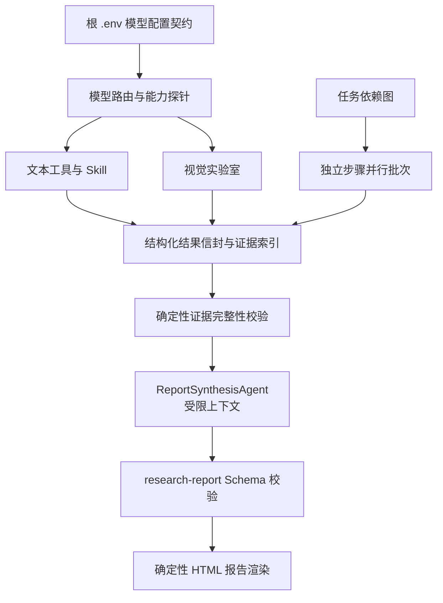

# 技术设计: 编排可靠性与证据化报告

## 技术方案

### 核心技术

- TypeScript、Node.js、现有 Gateway LLM Client、AJV JSON Schema 校验。
- 根 `.env` 作为跨独立服务的唯一模型配置来源；不新建跨工作区共享包。
- JSON Schema 作为 Tool、Skill 和报告的机器可读契约；报告 HTML 继续由确定性渲染器生成。

### 实现要点

1. 将模型选择明确为“请求级自动故障切换”，而非主动-主动热备。候选顺序固定为 `GPT-5.4-joybuilder`、`GPT-5.2-joybuilder`、`GPT-5-joybuilder`。
2. 以配置声明每个候选的 `text`、`vision` 能力和健康状态；能力必须来自启动/发布时的真实探针结果，不能从模型名称推断。
3. 429、超时、网络错误和 5xx 走可控重试/切换；400、401、403、422 视为不可切换错误。遵守 `Retry-After`，并通过熔断器防止故障模型持续消耗请求。
4. 使用统一结果信封包装所有 Tool/Skill 输出，领域数据置于 `payload`。允许向后兼容地消费旧格式，但新执行结果必须通过 Schema。
5. `ReportSynthesisAgent` 是逻辑隔离角色，不必新建进程。它只接收投影后的证据包、审阅结果、任务目标和报告 Schema，不能读取原始聊天上下文或任意工具日志。

## 架构设计



## 架构决策 ADR

### ADR-001: 保留唯一全局任务编排器
**上下文:** 当前有一个负责任务状态、审批、步骤执行与报告产物的核心编排器；各实验室可能有局部并行流程。

**决策:** 保留一个 `Task Orchestrator`，工具实验室仅作为被调用的执行单元。报告汇总使用独立角色边界，但不作为平级编排器。

**理由:** 任务状态、审批语义和产物归属必须有唯一权威；多个平级编排器会增加重试、状态回滚和报告来源冲突。

**替代方案:** 为每个实验室建立平级总编排器 -> 拒绝原因: 重复维护任务生命周期，复杂度超过收益。

**影响:** 文档和日志应以 `Task Orchestrator`、`Tool Internal Workflow`、`ReportSynthesisAgent` 区分职责。

### ADR-002: 以受限上下文替代单纯进程隔离
**上下文:** 当前最终汇总使用通用 LLM 调用，可能接收过多的原始执行内容。

**决策:** 建立 `ReportSynthesisAgent` 角色和输入投影契约；可在同进程内执行，后续仅在负载或安全隔离需求明确时再拆分为独立 worker。

**理由:** 上下文污染源于输入无边界，而不是调用是否位于独立进程。先实现受限输入、Schema 和追踪，可用更小变更得到主要收益。

**替代方案:** 立即增加独立 Subagent/进程 -> 拒绝原因: 若仍传入完整原始上下文，无法解决可信度问题，并引入部署与状态同步复杂度。

**影响:** 需要新增证据投影、引用检查和汇总输入大小上限。

### ADR-003: 配置中心化优先于代码包共享
**上下文:** 根项目不是 workspace monorepo，视觉和虚拟用户实验室是独立服务，直接抽取共享运行时代码会引入构建和发布耦合。

**决策:** 首期将根 `.env`/`.env.example`、启动脚本和配置校验器作为唯一配置契约；各服务实现相同的候选模型解析与健康上报。

**理由:** 满足单一配置来源，同时避免为少量配置逻辑新建共享包。

**替代方案:** 立即创建跨服务共享 SDK -> 拒绝原因: 当前没有包管理边界和发布流程，属于过早抽象。

**影响:** 配置漂移检查和契约测试是必须项；若重复逻辑持续增长，再单独评估抽包。

## API 设计

### 内部结果信封 v1

所有新增 Tool/Skill 输出采用如下稳定字段，`payload` 由各领域 Schema 约束：

```json
{
  "version": "1.0",
  "status": "succeeded",
  "summary": "结论摘要",
  "findings": [
    {
      "id": "F-001",
      "statement": "结论文本",
      "confidence": 0.82,
      "evidence_refs": ["E-001"]
    }
  ],
  "evidence": [
    {
      "id": "E-001",
      "source_type": "tool_result",
      "trace_id": "execution-id"
    }
  ],
  "assumptions": [],
  "limitations": [],
  "recommendations": [],
  "payload": {}
}
```

`status` 仅允许 `succeeded`、`degraded`、`failed`。`source_type` 至少区分 `tool_result`、`kb`、`user_material` 和 `llm_inference`。`llm_inference` 不得作为外部事实来源。

### 内部模型健康契约

模型健康记录应包含：候选模型 ID、能力集合、探针时间、状态、连续失败数、熔断状态和最近失败类别。日志仅保存脱敏错误类别与追踪 ID，不保存密钥、原始图片或完整提示词。

## 数据模型

在现有执行记录中增补以下逻辑字段；具体迁移在实施时以现有数据库结构为准：

```text
model_attempt: execution_id, model_id, capability, attempt_index, outcome, failure_class, latency_ms
evidence_item: execution_id, evidence_id, source_type, source_trace_id, citation_url?, excerpt_hash?
schedule_batch: execution_id, batch_index, step_ids, concurrency_limit, outcome
```

## 安全与性能

- **安全:** 不将 API Key、完整用户材料、图片 base64 或未脱敏上游错误写入运行记录；模型能力探针使用无敏感测试输入。报告引用外部 URL 时校验协议和来源。
- **性能:** 默认保持串行。仅对依赖图中入度为零、无共享可变状态的工具步骤并行，配置保守并发上限；聚合时按计划步骤序号稳定排序。
- **可靠性:** 对可重试错误设总请求预算和指数退避；熔断打开时快速切换，半开状态最多放行一个探测请求。

## 测试与部署

- **测试:** 单元测试覆盖失败分类、候选选择、熔断、Schema 校验和证据引用；集成测试使用可控网关/实验室夹具；上线前使用真实但无敏感输入的文本与图片探针。
- **部署:** 先灰度启用配置校验和观测，不修改默认报告行为；验证三模型后启用路由；Schema 采用兼容读取后再逐步强制；并行调度最后启用并可通过开关回退串行。
- **回滚:** 路由异常时将候选列表收缩为已验证模型；Schema 异常时保留旧读取路径并阻断新格式写入；并发调度异常时关闭开关恢复串行。
