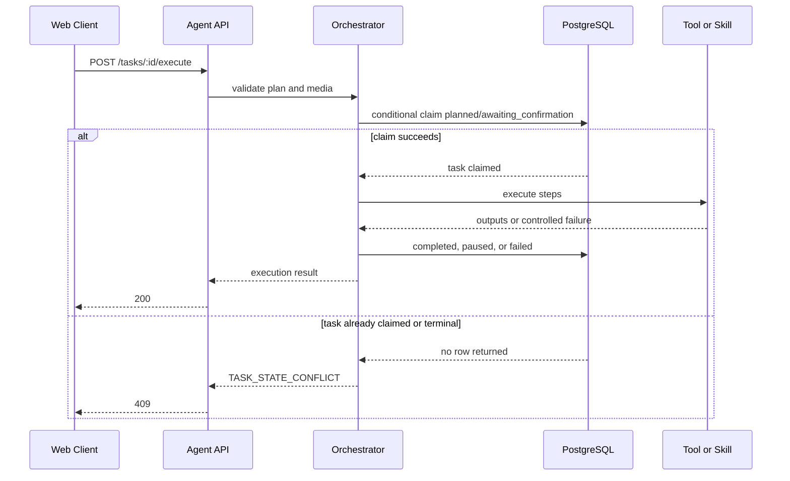

# 技术设计: 任务执行状态机加固与质量门

## 技术方案

### 核心技术

- TypeScript、Express、PostgreSQL、现有 `CheckpointStore` 和 `RunWorkspace`。
- 以 PostgreSQL 条件 `UPDATE` 作为跨进程互斥机制；不新增进程内 mutex、消息队列或锁服务。
- Node 内置 `node:test`、`fetch` 与临时 HTTP server 完成 API 集成测试；不为测试额外引入 `supertest`。
- GitHub Actions 执行已有确定性命令，不调用真实 LLM、浏览器或外部实验室。

### 实现要点

1. 在 repository 增加 `claimTaskExecution(taskId)`：仅当 `status='planned'` 且 `approval_state='awaiting_confirmation'` 时迁移至 `executing/confirmed`，并通过 `RETURNING` 返回是否领取成功。
2. `executePhase` 先读取计划并校验上传媒体，再调用领取操作；任何前置条件错误均不得写 `executing`。
3. `resumePhase` 采用独立的、只允许从 `paused/confirmed` 开始的条件迁移；`skip` 原子领取到 `executing`，`abort` 原子迁移到 `failed`，完成、失败和执行中的任务不允许经 resume 重放。
4. 引入稳定领域错误码，例如 `TASK_STATE_CONFLICT`、`MISSING_REQUIRED_MEDIA`、`INVALID_MEDIA_REFERENCE` 和 `UPSTREAM_EXECUTION_FAILURE`；路由只负责映射 HTTP 状态，不根据字符串匹配错误消息。
5. `createApp()` 组装中间件和路由，启动文件仅负责 `listen()`；测试创建临时应用与数据库夹具，验证完整 HTTP 合约。
6. 反馈聚合仅输出指标和样本，不回写 skill、prompt 或模型配置。报告回放指标先作为人工门禁，稳定后再考虑 CI 阈值。

## 架构设计



## 架构决策 ADR

### ADR-001: 以数据库条件更新实现执行互斥
**上下文:** `/execute` 可被双击、超时重试或多个客户端并发调用；现有普通状态更新无法判断谁先领取了任务。

**决策:** 使用带前置状态的单条 SQL `UPDATE ... WHERE ... RETURNING` 领取任务。领取失败即返回状态冲突，不再执行后续步骤。

**理由:** 状态已存储在 PostgreSQL 中，条件更新可跨 API 进程生效，改动小且可测试。

**替代方案:** 进程内 `Map` mutex -> 拒绝原因: 多进程部署失效且进程重启丢失状态。  
**替代方案:** 立即引入队列和分布式锁 -> 拒绝原因: 当前同步执行模型尚不需要新基础设施，复杂度超过收益。

**影响:** 任务状态转移成为受限接口；所有执行入口必须调用统一的领取/恢复方法。

### ADR-002: 前置条件校验先于状态迁移
**上下文:** 媒体缺失属于用户可修复输入错误，不应消耗执行名额或留下执行中状态。

**决策:** 在调用领取操作前完成计划、媒体角色、数量、MIME 和资产归属校验。

**理由:** 失败后任务仍可提交；错误语义与恢复路径明确。

**替代方案:** 先标记执行中，失败后回滚 -> 拒绝原因: 异常路径遗漏会制造僵尸状态，且回滚会掩盖真正的状态机缺陷。

**影响:** 校验函数需提取为无副作用逻辑并独立测试。

### ADR-003: 先建立质量门，再拆分编排器
**上下文:** `Orchestrator` 职责较多，但状态机缺陷与接口契约是当前确定风险。

**决策:** P0/P1 先在现有编排器内收敛状态入口和测试边界；仅在这些门稳定后，将规划、执行和报告交付分离。

**理由:** 先固定行为再移动代码，避免重构掩盖并发与状态回归。

**替代方案:** 同时重写执行器和状态机 -> 拒绝原因: 变更面过大，回归定位困难。

**影响:** 本方案不要求新增抽象层；P2 再创建独立重构方案包。

## API 设计

### POST /api/tasks/:id/execute

- **成功:** `200`，返回现有 `ExecuteResult`、执行日志和报告。
- **缺少或不合法媒体:** `422`。
  ```json
  { "code": "MISSING_REQUIRED_MEDIA", "message": "缺少必需媒体: design 至少需要 1 张" }
  ```
- **任务不处于可执行状态:** `409`。
  ```json
  { "code": "TASK_STATE_CONFLICT", "message": "任务正在执行或已结束" }
  ```
- **任务不存在或不属于当前用户:** 保持 `404`，不泄露任务存在性。
- **外部工具或网关不可用:** `502` 或 `504`，且任务按既有容错语义进入 `paused` 或 `failed`。

流式执行端点采用同一错误码作为 SSE `error` 事件载荷；在响应已经开始后不尝试改写 HTTP 状态。

## 数据模型

P0 不新增表和字段，使用现有字段：

| 字段 | 作用 |
|---|---|
| `research_tasks.status` | `planned`、`executing`、`paused`、`completed`、`completed_with_gaps`、`failed` 的执行生命周期 |
| `research_tasks.approval_state` | `awaiting_selection`、`awaiting_confirmation`、`confirmed` 的用户确认阶段 |
| `research_tasks.updated_at` | 用于展示最近状态变化；不作为自动抢占租约 |
| `execution_log` | 记录步骤状态与产物引用；不承担互斥锁职责 |

状态转换表：

| 当前状态 / 审批状态 | 操作 | 目标状态 / 审批状态 |
|---|---|---|
| `planned / awaiting_confirmation` | execute claim | `executing / confirmed` |
| `executing / confirmed` | 步骤失败 | `paused / confirmed` |
| `paused / confirmed` | resume skip claim | `executing / confirmed` |
| `executing / confirmed` | 全部完成 | `completed / confirmed` 或 `completed_with_gaps / confirmed` |
| `paused / confirmed` | abort | `failed / confirmed` |

## 安全与性能

- **安全:** 继续使用 owner 隔离和媒体任务隔离；错误响应不回显模型提示词、工具原始输出、文件路径或密钥。拓扑接口是否公开由独立 P2 决策处理。
- **性能:** 原子领取只增加一次单行数据库更新；不增加轮询、消息队列或全局锁。并发工具批次保持现有显式依赖约束。
- **可靠性:** 仅领取成功者执行外部调用。P0 不自动回收长期 `executing` 任务；如部署需要 worker 崩溃恢复，另行设计心跳和租约，避免猜测性重跑。

## 测试与部署

- **测试:** P0 离线回归覆盖缺少媒体不迁移状态、并发 execute 仅一次调用、完成任务拒绝重跑、resume 仅允许 paused。真实 HTTP 状态码和 SSE 契约测试留待 P1 `createApp()` 拆分后补齐。
- **CI:** 运行 `npx tsc --noEmit`、`npm test`、`npm run lint:registry`、`npm run lint:knowledge`、`npm --prefix apps/web run build`。真实网关和实验室 smoke 不进入 CI。
- **部署:** 先发布代码与 CI；以真实但无敏感输入手工验证一次重复提交和缺媒体路径，再允许常规用户使用。
- **回滚:** 若状态领取逻辑异常，回滚相关提交并人工检查卡在 `executing` 的任务；不得自动重跑已触发外部工具的任务。
