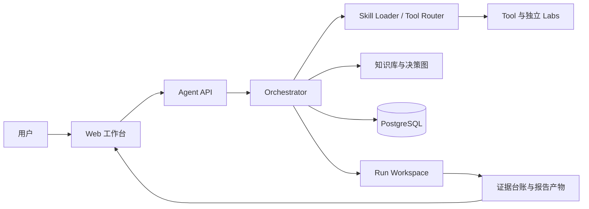

# 架构设计

## 总体架构

## 核心流程

1. `planPhase` 将原始用户输入结构化为 `ResearchTask`，激活决策图节点，召回方法论，并生成 depth/speed 候选计划。
2. 用户选择候选计划后，系统将其清洗为可执行计划，并聚合所需媒体输入。
3. `executePhase` 调用 Tool、Skill、LLM 和 reviewer 步骤；显式无依赖的连续工具可受控并行。
4. 每一步的上下文、输出、失败和配置 hash 写入任务工作区及数据库审计记录。
5. `ReportSynthesisAgent` 只读取受控证据台账和失败摘要，生成报告 V2，并输出 JSON 与自包含 HTML。

## 重大架构决策

| ADR | 标题 | 状态 | 说明 |
|---|---|---|---|
| ADR-001 | 保留唯一全局任务编排器 | ✅已采纳 | Tool/Lab 是执行单元，任务状态与报告归属由主编排器管理。 |
| ADR-002 | 受限证据上下文生成最终报告 | ✅已采纳 | 报告不直接将任意中间 LLM 摘要当作事实证据。 |
| ADR-003 | 数据库条件更新领取执行 | ✅已采纳 | `planned/awaiting_confirmation` 仅可由一次条件更新领取；恢复和终止同样要求 `paused/confirmed`。见当前状态机加固方案。 |
