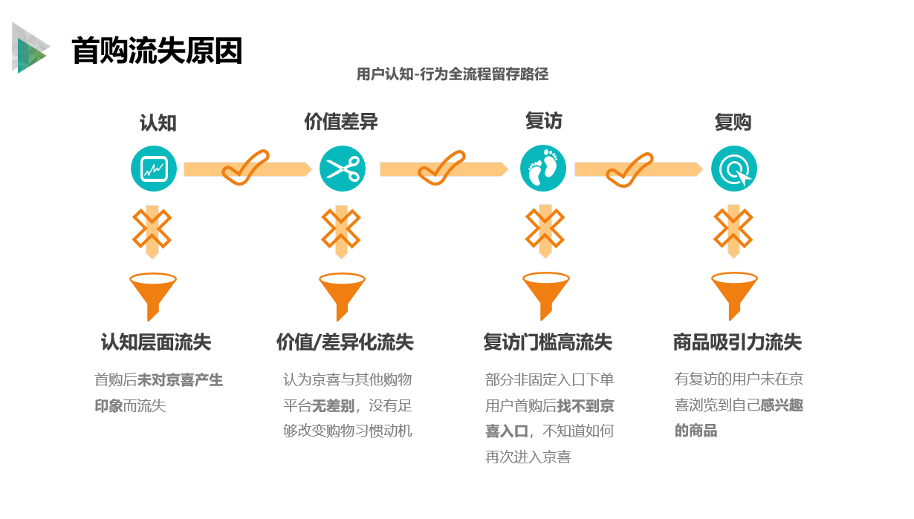

# 成长期平台低粘性流失调研打法（京喜首购流失复盘）

> 来源：神灯圈子·顾小妍（原作沙拉，2020-09-30）《成长期平台的低粘性用户流失调研——以京喜首购流失用户调研为例》 原文 http://xingyun.jd.com/shendeng/article/detail/46705（Joyspace 镜像 https://joyspace.jd.com/pages/B5hoM3uwx1QN7sx08H5y）

> 现成可直接拿来用的原子件——经验卡片（抽象后的打法）。
> 适用：遇到「成长期平台、用户集中在成长期、低粘性首购流失、缺成熟生命周期模型」这类问题时，用这套打法去触达、深挖并提炼流失原因。

## 内容

**这是一张经验卡片：遇到 X 类问题时用这套打法。**

X 类问题 = 平台成立时间不长、没有成熟的用户生命周期模型、且大量用户集中在成长期；要研究的是从成长期直接流失的低粘性首购用户。传统「基于生命周期模型做流失调研」的方法和思路在此较难行得通，需要专门针对低粘性用户进行触达、深挖及提炼流失原因。

### ① 流失对象选择：活跃用户流失 vs 低频用户流失

活跃用户与低频用户的流失，是两个完全不同的调研课题。

- **成熟平台（如京东主站）**：活跃用户对平台的价值远高于低频用户，所以对活跃用户流失的关注程度自然更高。
- **成长期平台（如京喜）**：最先要解决的问题是先把客户吸引来。运营业务侧把大量人力物力用在拉新上，但大批被引流进平台的新用户都堆积在初始阶段，他们没有经历「成长期—成熟期—衰退期」的生命周期，而是从成长期直接流失。相比活跃用户流失，这部分低粘性流失人群，才是成长初期平台更应着重关注的焦点。只有解决了低频用户的流失问题，让他们在平台上健康留存、成为活跃用户，才能保证平台良性发展。

基于以上判断，本次执行京喜流失用户调研项目时，圈定了**首次购物后即流失的低频用户**作为研究对象。

### ② 低粘性用户的触达与挖掘难点及应对

低粘性用户的流失原因挖掘，也不同于活跃用户。这群用户普遍特点是对平台认知、体验较浅薄，留下的后台行为数据也较少。

**触达难度（数据）**：此次京喜首购流失用户电访，累计呼出 **653 通电话，最后只成功访问到 55 位用户，成功率不到 10%**。访谈中用户说得最多的三句话是：**不知道、我没有、不记得**。

低粘性用户即便已经在平台下过单，仍会出现「不知道自己是在哪里买的、不记得自己买过」等让访谈无法继续的现象。

**应对方案**：

- 组织电访小组**每日进行访谈情况复盘**；
- 根据当日访谈中用户回应情况进行**模拟访谈**；
- 针对各种可能性的回答**动态优化访谈提纲**，以提高次日访谈时能挖掘到更多、更有深度的内容。

**随之而来的代价与再应对**：这样做虽能收集到用户更多信息，但针对不同用户设置的访谈提纲分支很细，导致访谈后信息细碎零散——这就需要用研同学在庞杂又细微的信息中梳理出主线逻辑进行深度剖析（即下文的核心方法）。

### ③ 核心方法：搭「认知-行为全流程」、规划留存路径、把结论挂到留存路径全景图

此次调研中，**规避了直接将访谈到的流失原因做归类整合的方式**，而是沉浸式进入用户角色：

1. 搭建新用户进入京喜后的**认知-行为全流程**；
2. 按关键节点（**认知 → 价值 → 复访 → 复购**）规划用户**留存路径**；
3. 再将访谈与数据分析中发现的结论按留存路径梳理，描绘出一幅用户从进入京喜到成功留存的**全景路径图**（见下图）。

有了这幅留存路径全景图，业务侧可以清晰认知到在每个节点用户的流失程度，并**按图索骥在各个关键节点针对性地制定召回策略，量化验证召回策略的有效性**。

### ④ 比喻：「用户做菜、用研摆盘」

这相当于把访谈中用户提供的琐碎信息当做烹饪好的一锅食材：一锅端地盛盘毫无意义，简单的荤素分类也体现不出它的价值。用研就是此时发挥作用的米其林大厨，用逻辑美学将食材整理摆盘，变成饕餮盛宴，刺激食客食欲。

### ⑤ 阶段性说明（重要边界）

此次调研**尚未完结**，本文只是针对调研过程中遇到的相对有代表性的问题进行了简单的解决方案探讨。待项目完结后，将进行完整复盘，梳理全流程方法论。

潜伏期（新用户）与衰退期（流失）的用户调研向来是用户运营类调研中的难点，但对平台而言又是研究价值相对较大的重点。本次调研集中在低粘性流失用户上，累积了以上**不成熟的经验**与各位分享，希望能对今后承接类似项目的同学有所助益。

## 使用说明

**适用条件（同时满足时最适用）**：

- 平台处于**成长期**、成立时间不长，缺成熟的用户生命周期模型；
- 用户大量集中在**成长期**，从成长期直接流失（而非经历完整生命周期后衰退流失）；
- 研究对象是**低粘性首购流失用户**（首次购物后即流失），认知浅、行为数据少。

**怎么用**：

- 先在「流失对象选择」上做判断——成长期平台应聚焦低粘性首购流失，而非照搬成熟平台「重活跃流失」的思路（见内容①）。
- 触达预期要放低：电访成功率可能不足 10%，用户高频出现「不知道/我没有/不记得」；用每日复盘 + 模拟访谈 + 动态优化提纲来逐日提升访谈深度（见内容②）。
- 分析不要直接对流失原因做归类整合，而是搭「认知-行为全流程」、按「认知→价值→复访→复购」规划留存路径，把访谈与数据结论挂到留存路径全景图上，供业务按节点定位流失程度、制定并量化验证召回策略（见内容③）。

**与流失用户调研打法的关系**：

- 本卡片是 [流失用户调研打法](../../methods/scenarios/category-consumption/cross-category/churn-user-research.md) 的**一手案例 / 经验卡片**——它不是通用流程本体，而是「成长期平台·低粘性首购流失」这一特定情形下的实战复盘与经验沉淀；承接通用打法时可作为该场景的参考样例。
- 卡片为**阶段性复盘**，方法论尚未跑完整，引用时注意其经验属性。

## 来源

- Joyspace《成长期平台的低粘性用户流失调研——以京喜首购流失用户调研为例》（神灯圈子，顾小妍 / 原作沙拉，原作写于 2020-09-30） https://joyspace.jd.com/pages/B5hoM3uwx1QN7sx08H5y
- 原文出处：神灯圈子 http://xingyun.jd.com/shendeng/article/detail/46705

## 关联

- related：
  - [流失用户调研打法](../../methods/scenarios/category-consumption/cross-category/churn-user-research.md)（本卡片为其一手案例 / 经验卡片）
  - [用户深度访谈](../../methods/toolbox/collection/interviews.md) （本卡片的触达与挖掘均以电话深访为主要手段）
