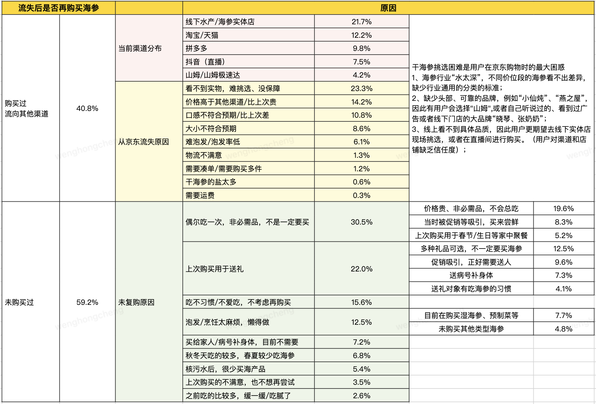

# 流失用户调研打法

> 来源：神灯圈子·翁鸿诚《流失用户调研》两讲 —— 第一讲《真假流失用户判断与识别》 原文 http://xingyun.jd.com/shendeng/article/detail/53607（Joyspace 镜像 https://joyspace.jd.com/pages/Zk7nBA4X6MA9utPrDRiQ）；第二讲《流失原因挖掘与召回策略》 原文 http://xingyun.jd.com/shendeng/article/detail/54796（Joyspace 镜像 https://joyspace.jd.com/pages/aGpPQYRRzOvAgUUaXTpf）

> 把 toolbox 方法编排成「流失这条线该怎么打」的应用指南。**本页只引用方法本体（按路径），不复制方法正文。** 全文以《海参品类的流失用户调研》为贯穿案例。

## 场景定义 / 典型问题

业务方常见提问：「我的品类流失率很高，**用户为什么流失？**」「**用户流失之后去了哪里？**」流失用户调研是用研的高频命题。这个场景常被问到的研究问题：

- **用户为什么流失？** 价格、体验、需求转移还是别的？
- **流失去哪了？** 转向其他平台、转向线下，还是转向其他品类/替代品？
- **是真流失还是假流失？** 如何定义「流失」？这条口径对当前品类成立吗？
- **当前流失是否严重？** 流失率绝对值高 ≠ 异常，需要相对参照来判断，并据此明确需求排期优先级。

整个流失项目通常拆成两个阶段：

> **阶段1、真假流失用户判断与识别**：如何定义流失用户？当前流失是否严重？流失用户有哪些特征？
> **阶段2、流失原因及召回策略**：用户为什么流失？该如何对用户进行召回？

## 推荐打法（编排）

两阶段、九步。「采集动作」一律引用方法本体（按路径），不在本页展开方法内容。

| 阶段 | 步骤 | 做什么 | 用什么方法（引用路径） | 目的 / 产出 |
|---|---|---|---|---|
| **阶段1 真假流失识别** | ① 明确流失的操作化定义 | 和业务方对齐「流失」口径，**按品类特性**确定判定条件（见下「流失定义按品类特性表」） | `methods/toolbox/analysis/voc-analysis.md`（口径对齐前可先扫一遍用户反馈） | 可执行的流失口径（含周期/沉默行为/季节性判定） |
| | ② 判断流失是否严重 | 不能只看一个流失率；从「品类自身 / 同级类目 / 上级类目」三维度看同比环比（见下「严重度判断三维度表」） | `methods/toolbox/analysis/longitudinal-benchmark-tracking.md`（同比环比/纵向口径） | 流失严重程度判断 + 需求排期优先级 |
| | ③ 后台数据画像下钻 | 先用后台数据刻画流失用户（流失 vs 复购对比），明确后续调研方向（见下「后台数据分析维度表」） | `methods/toolbox/analysis/key-driver-analysis.md`（流失 vs 复购的差异定位） | 流失用户画像 + 待验证猜想清单 |
| **阶段2 流失原因与召回** | ④ 分群、定优先级 P0–P3 | 按流失前购频/金额 + 流失后行为分层，定回访优先级与样本分配（见下「P0–P3 价值与样本分配表」） | —（分层依据来自步骤③的后台数据画像） | P0–P3 分群与样本分配方案 |
| | ⑤ 电话回访 | 冷启动快速触达，初步了解流失概况、为深研聚焦方向 | `methods/toolbox/collection/interviews.md`（访谈本体）；话术见 `assets/templates/churn-phone-interview-script.md` | 流失原因初判 + 是否需继续深研的判断 |
| | ⑥ 深度访谈 | 对典型用户**目的性抽样**，还原决策链路、探究「为什么」 | `methods/toolbox/collection/interviews.md`（访谈本体） | 鲜活、深入的流失/召回机制 |
| | ⑦ 定量问卷 | 对前期假设做量化验证、跑人群细分对比 | `methods/toolbox/collection/satisfaction-survey.md`；框架见 `assets/templates/churn-survey-framework.md` | 各原因占比、人群差异的统计证据 |
| | ⑧ 加权计算 | 非等比例抽样后必须加权，才能代表整体流失用户（见下「加权计算示例表」） | `methods/toolbox/analysis/key-driver-analysis.md`（占比/权重口径处理） | 修正后的整体流失原因占比 |
| | ⑨ 报告输出 | 按「背景-发现与洞察-行动」叙事；做交叉对比；行动配监测指标 | `methods/toolbox/analysis/voc-analysis.md`（原因文本归类）；`methods/toolbox/analysis/key-driver-analysis.md`（对比/驱动） | 分人群召回策略 + 落地监测指标 |

> ⑤⑥⑦ 三种调研方式**并不一定同时使用**，可按研究目标、资源与排期**灵活选择**：电话回访 500 人后若无超预期假设、也无需继续深挖，则不必再问卷或深访；若回访普遍暴露品质负评，则建议深访探因、或问卷下探。海参项目中三者结合使用，因为除「为什么流失」外，还要回答「为什么购买海参」「在品牌/价位/产地上如何决策」「为什么从京东转向淘宝、拼多多」。

## 本场景独有内容（完整保留）

### 阶段1 · 流失定义按品类特性表

在判断流失条件时，除依赖复购周期外，还可结合品类特性辅助判断。

| 品类特性 | 典型商品 | 特点说明 | 观察指标 |
|---|---|---|---|
| **高复购快消品** | 矿泉水、水果、纸巾等 | 单价低、购频高、决策成本低；用户很容易在其他平台购买，**复购周期无法准确判断用户是否流失** | 后台复购周期 + 用户沉默行为（不再搜索、浏览）。例：年购频 10 单的饮料用户，近两个月在站内无任何浏览行为，虽未超过站内平均复购周期，但仍值得关注 |
| **长周期耐用品** | 手机、大家电等 | 单价高、购频低且不固定、决策成本高；耐用品复购周期长且不稳定，用户跨平台比价行为明显，**不能以复购周期判断是否流失** | 后台复购周期 + 用户浏览行为 + 行业/品牌动态。例：① 用户 3 年前在京东购买冰箱，上个月浏览冰箱 20 余次后未下单，且近期再无浏览行为，虽未超平均复购周期，但大概率已流失；② 用户曾在京东购买 iPhone 13、14、15，在 iPhone 16 发布后无任何搜索浏览行为 |
| **季节性礼品** | 月饼、粽子等 | 用户购买集中在特定时间段，判定条件相对直接 | 季节性的周期性复购行为是否发生。例：去年中秋（8–9 月）购买月饼，但今年中秋促销期（9–10 月）未购买 |

> **海参案例口径**：海参（含干海参、即食海参）单纯将「1 年」作为周期判断是否流失（如：2022.7.15–2023.7.14 购买过、但 2023.7.15–2024.7.14 未复购）。原因：① 海参属高客单、低购频商品，站内平均年购频接近 1 单；② 海参送礼属性较强（尤其干海参），站内销售高峰集中在国庆、春节，以年为单位可区分流失状态。

### 阶段1 · 严重度判断三维度表

确定流失口径后，需通过数据判断严重程度，**不能单纯用一个流失率判断**。某品类流失率 80% 乍看很高，但不同行业、品类「健康」标准差异很大。了解严重程度有助于在需求排期阶段明确项目优先级。以海参为例（数据已模糊处理）：

| 参考维度 | 参考指标 | 举例说明（数据已模糊处理） | 猜想假设 |
|---|---|---|---|
| **看品类自身** | 干海参、湿海参的流失率，同比/环比变化 | **因海参购买时间相对集中，建议关注同比而非环比**。近一年干、湿海参流失率分别为 85%、80%，环比分别 +1.5pp、−1.8pp | 流失率绝对值虽高，但相对值无明显变化；湿海参留存甚至还在提升，说明海参品类流失未出现较大波动 |
| **看相关同级类目** | 鱼胶、冬虫夏草、干燕窝等的流失率 | 各品类流失率及环比（已模糊处理）：干海参 85.0%（+1.5pp）、湿海参 80.3%（−1.8pp）、鱼胶 82.7%（+2.0pp）、冬虫夏草 81.3%（+0.5pp）、干燕窝 79.2%（+0.8pp）、干鲍鱼 83.7%（+2.5pp） | ① 与海参客单价、功效接近且礼赠属性强的品类，流失率比较接近；② 除湿海参外，海产品流失率都有所上升，时值「日本核污水」舆论高峰期。猜想：是否因核污水事件导致海产品流失率整体提升？（后续调研验证） |
| **看上级类目/部门整体** | 干海参→南北干货；湿海参→海鲜水产 | 南北干货整体流失率 82%（同比 +1.2pp），其中鱼虾贝藻类 +2.3pp；海鲜水产整体流失率 79%（同比 +2.1pp） | ① 干、湿海参流失率符合品类整体表现；② 海产品流失率均有所提升，需进一步了解核污水事件对用户购买海产品的影响 |

### 阶段1 · 后台数据分析维度表（流失用户 vs 复购用户）

相比直接调研，建议先用**后台数据**分析流失用户构成，为后续调研明确方向。常用思路（流失用户 vs 复购用户，数据已模糊处理）：

| 分析维度 | 分析思路 | 举例说明（数据已模糊处理） | 猜想假设 |
|---|---|---|---|
| **人群画像分析** | 性别、年龄、线级、地区、十大靶群、PLUS | ① 复购用户中 PLUS 比例比流失用户高 20pp；② 复购用户 40 岁以上占比更高，比流失用户高 15pp | ① 海参客单价高，PLUS 专属折扣对购买促进明显；② 40 岁以上用户自用比例高，年轻用户送礼比例更高 |
| **用户行为分析** | **流失前**：购买频次、价位段、品类、最后一单是否客诉；**流失后**：是否搜索/浏览/加购/收藏、搜索关键词；**其他品类消费**：去年 vs 今年流失时间段购买品类差异、流失后还在京东买什么品类 | ① 流失用户中 85% 是年购频 1 单用户，2 单及以上用户流失率几乎无变化；② 流失后近半年在主站购买的品类中，医药-在线问诊-中医科比例最高 | ① 海参核心用户（2 单及以上）并未流失，后续应重点关注如何促进首单用户复购；② 流失用户对「健康、养生」关注度高，能否通过在线问诊、健康科普引导复购？③ 对健康养生关注度高却不复购，是否因海参属滋补品、食用后认为「没效果」 |
| **商品表现分析** | **品类通用属性**：流失前购买的价格段、品牌、店铺、差评率；**品类差异属性**：流失前购买的包装（散装、礼盒、组套）、口味等 | ① 流失用户中 80% 客单价在 300 元及以下（低客单），且集中在干海参；② 部分品牌流失率明显偏高，如头部品牌 80%、部分品牌达 90% | ① 300 元以下干海参属低价品，品质偏低（品种差、个头小、生长年份短、泡发率低）；② 高流失率品牌可能品质差、性价比低、差评率高 |

### 阶段2 · P0–P3 调研价值与样本分配表

相比在所有流失用户中「盲目回访」，**更建议先分群、定回访优先级**，让调研资源产出最大化。结合流失前购频、消费金额、流失后行为分层：

| 优先级 | 具体说明 | 调研价值 | 调研样本分配 |
|---|---|---|---|
| **P0** | 高价值流失用户：流失前海参购频、消费金额在**前 20%** | 深度诊断，探寻流失根本原因，寻找挽回方法 | **40%** |
| **P1** | 高意向的中、低价值流失用户：流失前购频/金额在前 20%–80%，且近期有海参品类浏览、加购等行为 | 定位转化障碍，弄清「临门一脚」失败的原因 | **30%** |
| **P2** | 剩余中价值流失用户（可按年龄、属性等抽取）：流失前购频/金额在前 20%–80%，处于完全沉默、对海参无浏览/加购 | 普适性验证，确认 P0/P1 发现的流失原因是否普遍存在 | **20%** |
| **P3** | 剩余低价值流失用户：流失前购频/金额在**后 20%**，处于完全沉默、对海参无浏览/加购 | 非必要，作为补充调研自行选择 | **10%** |

### 阶段2 · 三种调研方式对比表

三种方式不一定同时使用，按研究目标、资源、排期灵活选择。

| 分析维度 | 方法说明 | 优缺点 | 适用场景 |
|---|---|---|---|
| **电话回访** | 以客服回访形式直接电话沟通；事先未与用户接触（冷启动） | 优点：快速触达大量用户、直接了解流失原因；缺点：拒绝率高、沟通时间短、难以深度交流 | ① 研究初期，快速了解流失概况、为深研聚焦方向；② 快速验证某具体问题（如核污水是否影响购买海参）；③ 资源有限、无法大规模 1 对 1 深访 |
| **定量问卷** | 大量投放结构化问卷；为前期假设获取数据验证 | 优点：结果可量化、有说服力；缺点：依赖前期信息，选项设计不合理会致数据偏差 | ① 定性形成明确假设后，量化其影响范围（如究竟多少用户因价格流失）；② 需提供有统计说服力的数据；③ 需对不同用户群细分对比 |
| **用户深访** | 提前寻找、邀约目标用户；长时间交流（30–90 分钟） | 优点：获得「鲜活、生动、深入」的反馈；缺点：费时、样本量少 | ① 电话回访或后台数据发现异常、需探究「为什么」（如为什么海参用户转向燕窝）；② 需理解复杂的海参购买链路；③ 了解用户对某活动/策略的看法 |

#### 阶段2 · 电话回访阶段结论

通过对流失用户的回访，得出以下阶段结论与后续方向：

> 1、多数用户京东流失后未在任何渠道购买海参品类
> （1）作为自用品，海参高价且非必需，用户不会经常吃。如何给用户打造「长期吃」的理由？
> （2）作为礼赠品，用户无需长期购买。用户为什么在送礼时会选择海参？可将其作为拉新卖点。
> 2、线下是用户主要流向渠道，原因是海参行业「水太深」，线上用户难以看到实物、不知道怎么挑选。线上怎么做才能帮用户选购？

> 深度访谈用**目的性抽样**（区别于回访的分层抽样），从回访用户中筛选最有代表性的样本，重点关注 P0、P1，并结合流失原因、需求场景（自用/送礼）、目标价位段、年龄段区分。访谈人数无硬性要求，每类先选约 2 人，信息开始大量重复（饱和）即可停止。访谈技巧详见可复用素材链中的访谈本体引用。

### 阶段2 · 加权计算示例表

前几个阶段获得的流失原因比例**不能简单等于全部流失用户的比例**——因采用**非等比例抽样**，样本结构已无法代表总体流失用户的自然分布；直接用反馈比例会严重高估被过度抽样群体（P0）的意见。**评估「整体流失用户」原因比例时需对结果加权。**

以电话回访为例：
- ① **确定各类用户真实比例**：通过后台数据确认 P0–P3 在总体流失用户中的占比。例：总流失 10 万人，P0 有 5000 人（占 5%）、P1 有 15000 人（占 15%）。
- ② **权重计算**：权重 = 该类用户在总体流失用户的比例 ÷ 该类用户在调研样本中的比例。假如总体回访样本 500 人（P0 占 40%、P1 占 30%），则 P0 权重 = 5% ÷ 40% = 0.125，P1 权重 = 15% ÷ 30% = 0.5。
- 权重含义：调研中 1 个样本在总体中代表了几个人。若 P1 权重为 0.5，则分析整体时每个 P1 样本需 ×0.5。

| 优先级 | 总体占比（具体看后台数据） | 回访样本量及占比 | 权重 | 假设回访样本选择原因 A 的人数 | 加权后人数 |
|---|---|---|---|---|---|
| **P0** | 5% | 200（40%） | 0.125 | 10 | 0.125×10 = 1.25 |
| **P1** | 15% | 150（30%） | 0.5 | 20 | 0.5×20 = 10 |
| **P2** | 50% | 100（20%） | 2.5 | 15 | 2.5×15 = 37.5 |
| **P3** | 30% | 50（10%） | 3.0 | 5 | 3.0×5 = 15 |
| **合计** | 100% | 500（100%） | / | 50 人（修正前占比 10%） | 63.75 人（修正后占比 12.5%） |

### 阶段2 · 报告叙事线「背景-发现与洞察-行动」

通过「背景-发现与洞察-行动」链路构建报告叙事线，把复杂数据转化为逻辑清晰的报告。

- **背景**：说明调研背景与流失口径、流失现状拆解，重点使用阶段1（真假流失判断）的数据，指出需要重点研究的人群。
- **发现与洞察**：整合阶段2 数据，对不同人群、不同调研方式的数据**交叉验证**（见下「交叉对比」）。
- **行动**：提出可落地建议时，**同时提出落地效果的监测指标**，定期跟踪落地效果。

#### 交叉对比（发现与洞察的三类交叉）

- **流失用户 vs 复购用户**：对比两组在货品决策偏好、渠道选择等方面的差异。若流失用户普遍认为「京东价格竞争力」偏低、而复购用户感受偏中性，则价格可能是流失驱动因素；可重点分析流失反馈中价格相关因素占比，并列出具体商品、渠道价差增强说服力。
- **P0 高价值用户 vs P3 低价值用户**：高价值用户更关注品牌和品质、低价值用户对价格更敏感，说明挽回策略需差异化——高价值用户用高品质头部品牌召回，低价值用户用高性价比商品召回。
- **不同用户流失原因区分**：通过回访、问卷发现流失主要分三型——**价格敏感型**（因京东价格贵、促销门槛高流失）、**体验受挫型**（因物流、客服等不满意流失）、**需求转移型**（转去买大闸蟹、水果等）。

## 套用的理论透镜

- 本场景未直接调用独立理论模型；分层抽样后的占比修正逻辑见上「加权计算示例表」。

## 可复用素材

- 电话回访话术框架：`assets/templates/churn-phone-interview-script.md`
- 定量问卷框架：`assets/templates/churn-survey-framework.md`
- 访谈方法本体（深访/回访执行）：`methods/toolbox/collection/interviews.md` 
- 满意度问卷设计与清洗：`methods/toolbox/collection/satisfaction-survey.md`
- 原因文本归类 VOC：`methods/toolbox/analysis/voc-analysis.md`
- 驱动/对比分析 KDA：`methods/toolbox/analysis/key-driver-analysis.md`

## 交付物

- **流失现状 / 严重度**：流失口径 + 品类自身/同级/上级三维度的同比环比判断。
- **流失原因（加权后占比）**：经非等比例抽样加权修正后的整体流失原因排序。
- **分人群召回策略**：P0–P3、流失用户 vs 复购、价格敏感/体验受挫/需求转移三型的差异化召回。
- **监测指标**：随行动建议一并给出，用于定期跟踪落地效果。

## 参考报告（按权限可见）

- `assets/playbooks/growth-platform-low-stickiness-churn.md`（成长期平台低粘性/首购流失复盘经验卡片）

<!-- 合并自 神灯46582 -->
### 参考案例：京造首单流失研究（三步法 + 拐点理论）

> 作为海参案例之外的**第二个参考案例**。京造（自有零售品牌）首单流失研究提炼出「零售品牌流失研究三步法」，并补充了运营时间点上的**拐点理论**视角。零售品牌与互联网产品的流失研究有相似处，但细节判定上不同——核心差异在于：用户可能「买了却不知道是什么品牌」（无品牌认知），也可能受品类购物周期、品牌品类丰富度影响，在界定的流失口径下**主观上并不认为自己流失**。

**三步法**

- **STEP1 按流失程度分层**：先按「品牌认知度」与「复购意愿」对流失用户分层，区分三类——**无认知流失**（买了却不知道是该品牌，如不知道某商品属于戴森）、**非态度流失**（受品类周期/品牌丰富度影响，未购但并非因负面态度）、**真正态度流失**（经历过不好的体验）。三类未购原因差异很大，不能混为一谈。原因：① 互联网产品下载-打开-使用路径清晰、用户知道自己用了什么，零售品牌则可能无品牌认知；② 零售品牌受品类购物周期与品牌品类丰富度影响，一段时间未购≠流失（如买过戴森吹风机后半年未再购，难判定已流失）。
- **STEP2 探究流失原因**（提问的三类陷阱与对策）：① **用户也不知道原因**——无品牌认知用户无法主观回答为何不复购，对策是**匹配后台订单数据**，分析其首单购买特征/具体商品，推测哪些商品、哪些行为更易导致「购买却无认知」，再针对性优化；② **用户判断不一定准确**——非态度流失用户没思考过此问题，易用「没需求」「没看到」敷衍，对策是**用询问行为代替直接问为什么**（问近期购物需求、是否到京东找过、是否看到过京造商品，由研究者判断是否真的无需求/没看到，而非让用户自评）；③ **正确的答案不一定有用**——京造品类跨度大、各品类关键决策原因不同，混在一起的结论无法指导优化，对策是**设计完题目后检查答案对决策有何帮助**（增加「最近一次看到的是京造哪个品类」并针对该单品类问未购原因，结果验证不同品类未购原因确有差异）。
- **STEP3 思考如何召回**：用 5W 框架设计——何时（when）、何地（where）、对谁（who）、以何方式（how）、传达什么信息（what）；据此反推研究中需采集哪些信息来回答这些问题。

**拐点理论（运营时间点）**

- **拐点理论**：界定的流失用户（一段时间内无关键行为）在流失后会陆续回访，回访率随时间推移逐渐下降至某稳定值。运营希望找到回访率变化的**拐点**（即用户刚流失的时间点）：想**防流失**应找**最晚干预时间**（过早干预会把资源浪费在不干预也会回流的用户上）；想**挽回流失**应找**最早干预时间**。拐点理论本质是从**资源投放效率**角度考虑的。
- **京造的补充发现**：首单后**一周内是复购高峰**——推测新用户对品牌仍有好奇与新鲜感、基于首次良好体验想进一步了解甚至完成第二单，此时给予刺激与引导（帮其完成第二单）提升复购效果可能更好；同时借鉴拐点理论，从资源投放优化角度可在**首单后一个月（复购变化拐点）**给用户一次优惠提醒。
- **协作模式经验**：研究过程中与需求方运营、数据分析师保持紧密合作，在数据提取、报告思路、结果解读上获得其专业视角输入，补足对业务不够了解的短板。

## 来源与参考

- 神灯圈子·翁鸿诚《流失用户调研第一讲：真假流失用户判断与识别》 http://xingyun.jd.com/shendeng/article/detail/53607（Joyspace 镜像 https://joyspace.jd.com/pages/Zk7nBA4X6MA9utPrDRiQ）
- 神灯圈子·翁鸿诚《流失用户调研第二讲：流失原因挖掘与召回策略》 http://xingyun.jd.com/shendeng/article/detail/54796（Joyspace 镜像 https://joyspace.jd.com/pages/aGpPQYRRzOvAgUUaXTpf）
- 神灯圈子·赵真真（原作者春天的小鸽K，2019.07.23）《零售品牌流失研究怎么做——以京造首单流失用户为例》 http://xingyun.jd.com/shendeng/article/detail/46582（另见同篇 detail/46603）
