# B 端系统体验度量打法

> 来源：神灯圈子·王仰龙《B端系统体验度量OnePage》 原文 http://xingyun.jd.com/shendeng/article/detail/52413（Joyspace 镜像 https://joyspace.jd.com/pages/OVrKVjTmc9ThLkN3NGDN）

## 场景定义 / 典型问题

体验是使用者的主观感受和想法，而度量是一种理性的评价方法。本打法面向**B 端系统**（采销、供应商等内部/外部业务系统），目标是站在中立客观角度，通过量化体验确定各产品的体验质量，持续追踪体验趋势，和业务、产研团队一起发现问题、形成共识并改善体验。

这个场景常被问到的研究问题：

- 如何为一个 B 端系统/平台**定义可长期追踪的体验北极星指标**？
- 系统模块/任务链路众多，如何把总指标**拆解**到可定位问题的颗粒度？
- 怎样**低成本、可持续**地采集主观体验数据，又不过度打扰用户？
- 体验指标涨跌了，是真的变化还是**抽样误差/用户结构/外部环境/产品动作**？

**B 端系统体验四特点**（决定了打法与 C 端不同）：

| 特点 | 说明 | 对度量的影响 |
|---|---|---|
| **参与度高** | 绝大部分 B 端用户「必须/不得不」使用系统，使用频率规律 | 参与度不适合衡量体验（C 端的活跃用户数、购频、复访问率等在此失效） |
| **关注性能** | B 端注重生产力和工作效率，前提是系统性能稳定可靠 | 卡顿、崩溃等问题严重影响效率，需纳入观测 |
| **任务导向、重视效率** | 使用产品一般是为解决某个确定的需求或问题，并期待新的降本增效方式 | 费力度/任务完成视角比泛化满意度更切题 |
| **基建难度大** | 系统分散程度高，数据埋点很基础，用户使用路径复杂 | 较难定义通用的客观体验指标（如转化率、停留时长等），主观指标常需先行 |

采销

供应商

## 推荐打法（编排）

| 步骤 | 用什么方法（引用路径） | 目的 / 产出 |
|---|---|---|
| 1 定义北极星指标 | 本篇「搭建度量体系 · 定义北极星指标」 + `methods/toolbox/analysis/experience-metrics-heart.md` | 在满意度/费力度/继续合作意愿/推荐意愿中选定全局体验指标 |
| 2 拆解度量体系 | 本篇「搭建度量体系 · 搭建体系化测量」（因子分解法 / 客户旅程法） | 把北极星指标拆到子系统/任务触点，便于定位问题 |
| 3 设计与采集主观指标 | `methods/toolbox/collection/satisfaction-survey.md`（问卷设计与清洗）+ 本篇「数据采集 · 投放与频控、题型设计」 | 问卷调研 / 场景化调研 / 可用性测试三法落地，含频控、净满意度 NSS 题型 |
| 4 估算样本与误差 | 本篇「数据采集 · 最小样本和误差估计」 | 投放前算最小样本量、回收后估抽样误差 |
| 5 趋势归因 | `methods/toolbox/analysis/satisfaction-drop-attribution.md`（异动归因）+ 本篇「归因与应用 · 趋势波动分析」 | 区分抽样误差/用户结构/外部环境/产品动作，定位关键问题点 |
| 6 改善验证 | `methods/toolbox/analysis/ab-testing.md`（在线对照实验，按需）+ 用户之声平台线上化管理 | 体验问题统一管理、改善并验证效果 |

---

## 该场景特有内容

> 以下为 B 端体验度量独有的体系/口径，完整保留。通用方法本体（体验度量、满意度问卷、异动归因、AB）见上表路径，不在此复述。

### 搭建度量体系

#### 定义北极星指标

北极星指标通常是一个关键指标，全局性地反馈系统的体验。结合 B 端系统特点，推荐四类指标：

| 指标 | 应用场景 | 优势 | 劣势 |
|---|---|---|---|
| **满意度** | 用户对产品或服务是否满意，反映的是用户期望和实际差距。**示例：你对 XX 产品的满意程度是？** | 灵活即时，适合在整体或局部各个层次询问，可以收集即时性反馈。 | 测量过去的体验，不一定能反应未来的行为；一次差体验会严重影响评价，用户评价可能会趋于中性。 |
| **费力度** | 用户使用产品或服务来解决问题的难易度程度，减少使用阻碍。**示例：使用 XX 产品完成 XX 工作的容易程度是？** | 侧重基础体验，适合 B 端任务导向的交互场景，高费力度容易造成流失，一定程度预测未来的行为。 | 评价不够全面，侧重操作层面的易用性。 |
| **继续合作意愿** | 预测性指标，用户是否愿意持续使用产品或服务。**示例：你愿意继续使用 XX 产品吗？** | 直接预测未来行为，综合性指标，反映长期价值。 | 容易受到市场环境等外部因素的影响。 |
| **推荐意愿** | 用户推荐产品或服务的可能性，反映的是口碑和忠诚度。**示例：你推荐 XX 产品的可能性是？** | 关注用户整体态度，指标全面且综合，推荐隐含着留存和潜在的增长。 | 不一定和现实行为强相关，需要更细指标定位问题；B 端场景不一定通用。 |

#### 搭建体系化测量

体验度量需要诊断出当前系统存在的问题，以便持续改善体验。结合以往的实践，推荐两种拆解思路：

| 方法 | 适用场景 | 拆解思路 |
|---|---|---|
| **因子分解法** | 各个子系统或模块相互独立，通过拆解全面覆盖所有的子系统。 | **示例：** · 北极星指标：供应链产品满意度 · 供应链产品满意度 = 库存产品 + 价格产品 + 履约产品 + 品规产品 的满意度 · 库存产品满意度 = 采购执行 + 采购价格 + 采购决策 + 内配执行 + 退供执行 + 销售计划 + … 的满意度 |
| **客户旅程法** | 从开始到结束的任务视角导向，拆解各个任务触点的体验，在任务结束后测量体验。 | **示例：** · 北极星指标：商城黄金流程满意度 · 黄金流程满意度 = 首页 → 搜索 → 商详 → 购物车 → 结算 → 收银台 → 订单详情 的满意度 · 首页体验关键要素：整体布局、入口查找、视觉风格、… |

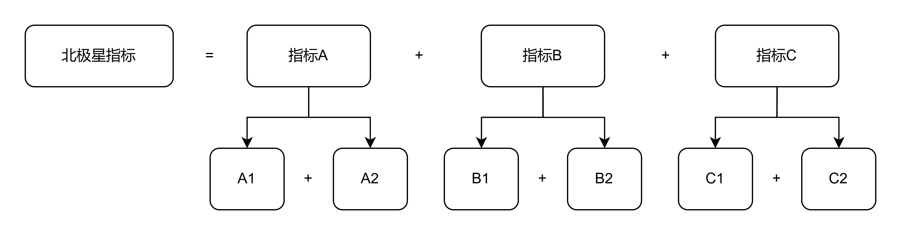

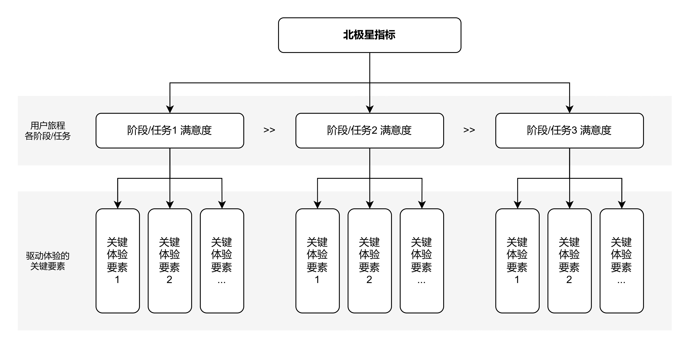

### 数据采集方法

#### 主观指标采集

长期来看，体验度量需要**主观评价指标 + 客观行为指标 + 业务收益指标**来进行综合评价。在敏捷、可快速落地角度上，可以先从主观评价指标入手，目前有三种主观数据采集方法：

1. **问卷调研**：用户填答一套完整问卷，评价产品或服务体验各个方面，从整体到细分指标，详细收集问题。长问卷的优势是可以计算细分指标对总指标的影响程度，明确问题的优先级；风险是样本回收率低。
2. **场景化调研**：用户在使用产品过程中，页面主动弹出短问卷，通常采用 1–3 题，单题评价 + 不满意原因 + 开放文本反馈。优势是在产品页面触点收集即时性反馈，面向使用者、针对性强；风险是指标维度单一。
3. **可用性测试**：用户在完成特定的操作任务，访问员观察操作行为，记录操作卡点，并收集体验评分。优势是不完全依赖主观反馈，更系统地发现问题；风险是执行成本高、样本少。

> 问卷设计、信效度与数据清洗的方法本体见 `methods/toolbox/collection/satisfaction-survey.md`。

#### 场景化及投放策略

用户之声有场景化调研组件，可以低成本地在产品页面布点。参见 [V3.0「场景满意度组件」接入流程](https://joyspace.jd.com/pages/1ivmCbmiPIeZ7wVaqhXp)。

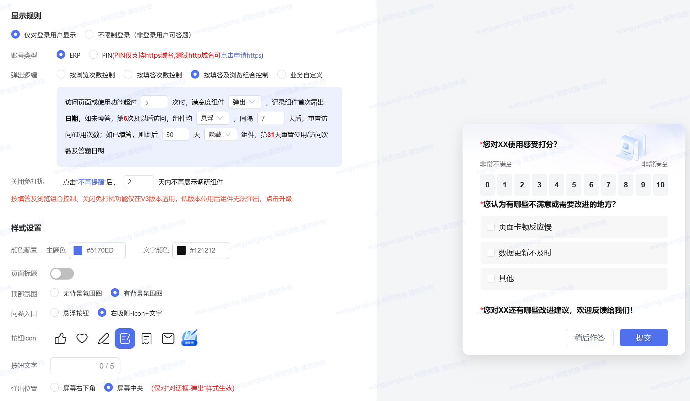

主观评价收集时，需要关注数据回收的量级和有效性。结合过往的实践，推荐一些投放和频控思路：

**1. 问卷怎么投放**

- **调研对象：** 对系统使用者进行摸底调研。①避免非目标用户的评价，如系统的研发测试；②通过访问频次、权限等条件，过滤掉仅单次访问、无权限的用户。
- **投放时机：** 最简单的方式是在页面上直接布点，也可以在特定任务结束后一定时间内弹出问卷，如客服接线暂停的空闲期间弹出问卷。
- **主动询问：** 推荐采用主动弹出，虽然会牺牲一定的体验，但能采集到相对全面的反馈；静默的被动评价大部分是遇到问题，存在明显的偏差。

**2. 防打扰机制（频控）**

- **单题频控：** 在一定时间周期内，建议每个问卷最多弹出 1–3 次，每次弹出的间隔也可以拉长，避免集中打扰。
- **全局频控：** 一个系统有多个场景化问卷时，对于同一个用户，每天最多弹出一个问卷，避免过度打扰。
- **填答频控：** 在一定时间周期内，建议每个用户整体填答次数最好不超过 3 次，避免多次评价影响整体评分。

#### 题型设计与统计

无论哪种主观数据采集方式，最小单元的题型通常是：**体验评分 + 不满意原因 + 开放题采集原声**。

**评分样式：推荐 0–10 级打分**

- 研究表明，4 级、5 级、6 级、11 级评分均值差异不大，11 点量表最接近正态分布，量表的敏感性最好，减少了天花板效应和地板效应，更常见且易于理解；
- 对于长问卷调查，考虑到问题数量较多、填答容易产生疲劳，可以选择 5 级或 6 级打分（如 1–5 分）。

**统计方式：净满意度（NSS）**

- 满意度均值的波动不够直观，满意占比会丢失低分情况，推荐净值计算方法，即：

$$\text{净满意度（NSS）}=\text{满意}\%-\text{不满意}\%$$

- 对于 0–10 级打分：

$$\text{NPS / 净满意度}=(9\text{–}10)\%-(0\text{–}6)\%$$

**数据上报：关联后台标签**

- 用于满意度分析及问题下钻，如：用户特征（身份角色）、行为特征（高频/低频等）、对应产品模块等。

#### 最小样本和误差估计

主观评价是抽样数据，在问卷投放前后，需要估算最小样本量和抽样误差。在线工具：[sample-size-calculator](https://www.calculator.net/sample-size-calculator.html)。

综合数据精度和执行成本的考虑，一般情况下推荐设定：**95% 置信水平（Confidence Level）、3% 误差范围（Margin of Error）**。假设满意度 50%，意味着我们有 95% 的信心认为总体真实的满意度在 47%–53%。置信水平越高、误差范围越小，所需的样本量越大。

调研总体（Population Size）可根据系统当前的用户量设定；总体比例（Population Proportion）为全量用户的百分比，如满意的用户占比。如果满意度未知，可以设为 **50%**，此时所需样本量最大。

**1. 问卷投放前，计算所需最小样本量**

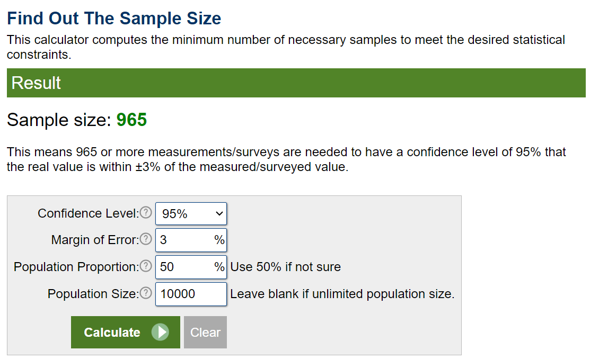

**2. 问卷回收后，估算抽样误差**

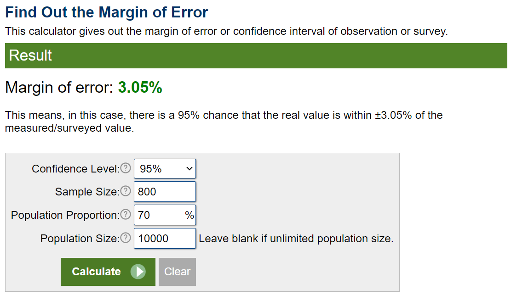

### 归因与应用

#### 趋势波动分析

体验度量适合长期 AA 趋势跟踪，指标趋势归因能更好地帮助我们理解体验的变化、定位关键问题点。对于体验指标的波动，可以从以下四个影响因素进行分析：

| 影响因素 | 归因分析 | 对应策略 |
|---|---|---|
| **抽样误差** | 抽样填答的随机性会导致指标波动，如满意度上升或下降可能是抽样误差导致，而不是发生了质的变化。 | 用 [显著性检验工具](https://www.evanmiller.org/ab-testing/t-test.html#) 分析，也需要关注连续性趋势，可能量变引发质变。 |
| **用户结构** | B 端系统用户量级相对有限，可能受到产品阶段、运营策略等因素影响，客群结构在短期内发生较大变化。 | 对用户进行分层，分析每层用户结构、体验指标变化；假定用户结构不变时，预估满意度变化。**示例：** · 1 期调研：新用户占 20% 满意度 50%，老用户占 80% 满意度 70%，整体满意度 66%。 · 2 期调研：新用户占 50% 满意度 55%，老用户占 50% 满意度 65%，整体满意度 60%。 · 结构因素：假设用户结构不变，2 期新用户仍占 20%，整体满意度为 63%，即 3% 受到结构因素影响。 |
| **外部环境** | 产品没有大幅改动，但在市场环境、竞品策略、特殊时间点的影响下，体验指标可能出现大幅波动，如大促节点。 | 持续关注外部竞争环境因素影响。体验指标日常追踪适合通过环比（如 8–9 月环比）；对于特殊节点，更适合同比（如今年双 11 同比去年双 11）。 |
| **产品动作** | 受到产品迭代、系统稳定性等因素影响，导致体验指标发生变化。 | 通过采集各类信号定位关键问题，包括但不限于： · 不满意原因选项分析、用户原声、不满意用户回访； · 系统工单问题分析； · 客观指标分析，如访问 PV、停留时长、卡顿率等。 |

> 异动归因的方法本体（显著性检验、下钻、回访的标准流程）见 `methods/toolbox/analysis/satisfaction-drop-attribution.md`。

#### 体验问题改善

体验度量并不止于指标统计，最终是希望团队关注体验、对体验问题达成共识。体验问题的解决不同于工单处理流程，多数问题需要经过产品设计、研发测试等多个环节。B 端可以使用**用户之声平台**，收集各个渠道体验问题，并统一线上化管理。

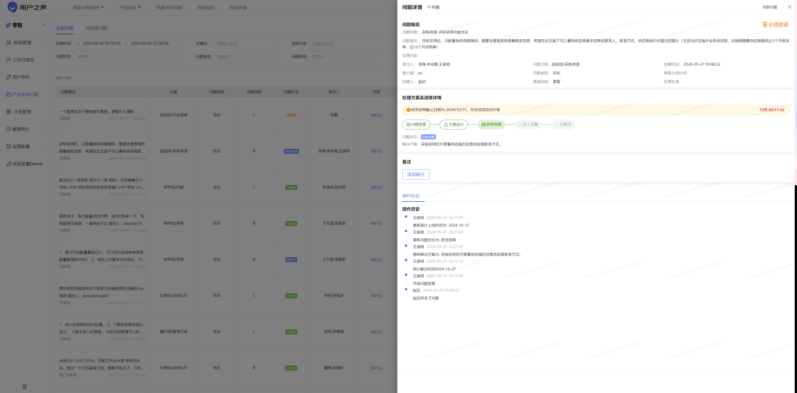

<!-- 合并自 神灯46482+46501 -->
### 体验管理体系（数据-系统-运营三层）

> 把单点的体验度量上升为可长期运行的「体验管理/监测」体系时的通用骨架。体验是用户在使用产品、系统或服务之前、期间与之后的全部主观感受，不像注册/点击/付费/订单那样的操作事实那么容易追踪和衡量，因此需要从宏观、战略视角对「整体」体验进行管理，聚合并分析全渠道、全流程的体验数据。按工作内容的覆盖范围，可分为**数据层、系统层、运营层**三层结构，每层都有明确的目标与内容。

| 层级 | 目标 | 主要工作内容 |
|---|---|---|
| **数据层** | 建设体验数据，量化体验水平，追踪体验变化 | 先找到能直接或间接反映用户情绪感受的数据并构建收集渠道。结合体验度量的数据维度分为两类：①**用户自我报告式的主动反馈类数据**——满意度评价（CSAT）、推荐意愿（NPS）、客户费力度（CES）等整体感受数据，以及用户经客服/在线反馈渠道针对特定问题的反馈，主要通过直接询问或用户主动反馈采集；②**系统埋点收集的客观行为类数据**——用户与产品/服务的交互过程数据，如整体使用频率、使用时长、分享率，以及重点功能/页面的点击率、转化率、跳出率，主要由系统后台自动记录。此外可增加**辅助型特征数据**（性别、年龄、会员等级等），以便整体体验水平变化时下钻到是哪个群体导致。 |
| **系统层** | 构建体验管理系统，承载体验数据，提效体验运营 | 系统层是体系的中间层，重点在系统建设。其一，系统是体验数据的**承载系统**：单期数据缺少对比基准、参考意义有限，需长期采集并做不同时间的体验水平对比，才能及时发现变化、找到需重点提升的用户群体/产品模块/服务环节；通过系统完成数据的自动采集、自动分析、自动诊断，既能长期及时采集，又能节省人力、减少人工计算失误。其二，系统是体验运营工作的**主要辅助工具**：监测分析诊断只是基础，最终目的是促进体验提升，围绕提升还有产品/服务体验问题的优化跟踪、团队/公司体验文化建设等大量运营工作需要系统支撑。 |
| **运营层** | 构建运营机制，分析体验数据，管理体验问题，维护体验用户，建设体验文化 | 运营层是围绕用户体验的人工干预工作总称，日常包含四方面：①**体验数据分析**——对数据结果做统计整理、跟踪与综合分析（如结合主观+客观数据评估特定功能/服务的体验），并及时同步给责任团队、协助其分析变化；②**体验问题管理**——联合责任团队分析优化问题，常需快速调研验证问题、评估严重性、找解决方案，并推动/协助完成优化、跟进进度与效果；③**体验用户维护**——对典型用户群体或社区做日常管理与活动组织，及时获取体验情况与创新方案的用户态度，引导用户深度参与产品/服务的设计与迭代；④**体验文化建设**——通过数据/专项研究结果传播、协同机制构建、活动组织、考核机制创建等，培养各团队关注体验的意识、营造积极推动体验优化的氛围。 |

落地提示：体验监测管理不是一次性专项研究或优化，而是与商业目标/业绩提升直接相关的**长期性工作**；各层在实际开展中都有大量细节（数据层的度量指标体系构建、系统层的功能设计开发、运营层与各团队的协同机制沟通与运行等），需要足够耐心持续探索优化。

<!-- 合并自 神灯46478 -->
### 落地经验：体验度量中的多方沟通共识

> 体验度量模型的搭建与应用往往涉及多方（业务、产研、设计等），沟通共识是增进理解、高效协作的基础。以下从共识**目标 / 内容 / 方式**三方面梳理非理论方法部分的落地经验。

**1. 共识目标：拉齐理解 + 对齐标准**

- **拉齐理解**：减小彼此的认知差距。总体上拉齐对度量长短期价值与目标的理解；到各执行阶段，再拉齐对所需资源与预期输出的理解。
- **对齐标准**：选择团队认同的维度指标与监测方式。个体对体验优劣的主观感受、不同岗位的关注视角各不相同，应以产品定位规划为指导、结合客观资源情况选择合适的衡量标准。例如对内的商户操作系统与竞对在操作层面比较意义不大，「功能完整性」等对标维度参考价值降低，可考虑暂不纳入监测；而确定维度后下探的监测指标是共识的主体，若业务首要关心的指标（如产品 SOP「使用率」）与已确认的指标定义高度贴合，不妨直接优先接入。

**2. 共识内容：按立项前 / 执行 / 复盘三阶段**

- **立项之前**——①**确认是否要做体验度量**：模型从搭建、验证到持续应用是渐进过程，需要充足数据与稳定调研机制；探索/深化初期产品调整频繁、数据待完善，此阶段可先辅助完善埋点、定期走查、用户调研等机制，但对前期数据的分析价值预期应适度降低。②**首期度量的范围与预期**（首因效应不可忽视）：可「由局部扩充至整体」——圈定最小度量范围，降低试跑成本、为当前业务需求提供辅助价值，但要始终遵循统一框架、避免过度定制化；也可「由整体完善至局部」——先接入已长期监测的宏观指标，再逐步下探，但宏观指标初期可能无法解释数据现象，需多期下探追踪定位原因。
- **项目执行**——①**指标统计**（共识主体，具体选取与统计方式见体验度量模型本体）：两个小方法是**准备详细参考资料**（在具体案例指标上调整远胜凭空讨论）与**选取整合已有资源**（避免重复造轮子，如已有相似 NPS 调研制度则接入现有数据，再优化细项与收集方式）。②**分析提炼**：结合业务所需**明确重点分析方向**，聚焦深挖原因、避免结果泛泛；并**明确优先级共识**，推动度量结果逐步落地，而非停留在「报告」阶段。
- **项目复盘**——**如何评定度量的投入产出**：度量周期长、问题定位较宽泛，价值常被分散到常规需求、难以被跟踪记录；与需求绑定是方向，但仍是有待探索的难点。

**3. 共识方式：态度与形式**

- **中立**是沟通基础：每个环节共识前可先单独收集成员思路，引导其放心分享见解、提高效率，不必当即讨论对错。
- **内部访谈**：基于成员职责差异制定访谈大纲与沟通顺序，便于高效沟通与记录，并帮助理解产品表象之下的业务逻辑。
- **稳定的节奏**：明确每阶段待办与负责人，定期组会对齐进度、定期汇总小结、逐层汇报共识，争取更广泛团队成员的认可。

## 该场景特有注意点

- **不要照搬 C 端活跃类指标**：B 端用户「不得不」用，参与度/活跃度不反映体验质量，优先用满意度/费力度等主观体验指标。
- **频控三层缺一不可**：单题频控（1–3 次/周期）、全局频控（每人每天最多 1 份）、填答频控（每人累计不超过 3 次），否则会过度打扰并污染整体评分。
- **主动弹出优于静默被动**：被动评价多为「遇到问题才来」，存在明显偏差；主动询问虽牺牲一点体验但反馈更全面。
- **涨跌先排除「非质变」因素**：先用显著性检验排除抽样误差，再做用户结构分层（结构不变假设）扣除结构因素，最后才归因到产品动作。
- **过滤非目标用户**：研发测试、单次访问、无权限用户的评价应通过访问频次/权限条件剔除。
- **样本未知时按 50% 取最大样本**：总体比例未知时设 50%，确保 95% 置信、3% 误差下样本量充足。

## 套用的理论透镜

- `methods/toolbox/analysis/experience-metrics-heart.md` — 体验度量框架（HEART/GSM）与北极星指标选取
- 标准化体验量表计分与基准：`assets/scales/standardized-ux-scales.md`

## 可复用素材

- 满意度问卷设计与数据清洗：`methods/toolbox/collection/satisfaction-survey.md`
- 标准化 UX 量表（SUS/UMUX-Lite/SEQ/NPS/CSAT/CES 计分与基准）：`assets/scales/standardized-ux-scales.md`
- 在线工具：[最小样本量计算器](https://www.calculator.net/sample-size-calculator.html)、[显著性检验工具](https://www.evanmiller.org/ab-testing/t-test.html#)

## 交付物

- B 端系统**体验北极星指标定义**（满意度/费力度/继续合作意愿/推荐意愿之一）及拆解树（因子分解 or 客户旅程）
- **场景化问卷/题库**（体验评分 + 不满意原因 + 开放题）与频控配置
- **最小样本量与抽样误差**估算单
- **趋势追踪 + 归因报告**（四因素拆解，含用户结构分层）
- 用户之声平台上的**体验问题线上化管理看板**

## 附录：常见的体验度量模型

| 模型 | 度量体系 | 测量方法 | 公司 |
|---|---|---|---|
| **HEART** | 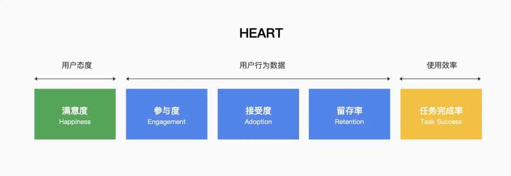 | 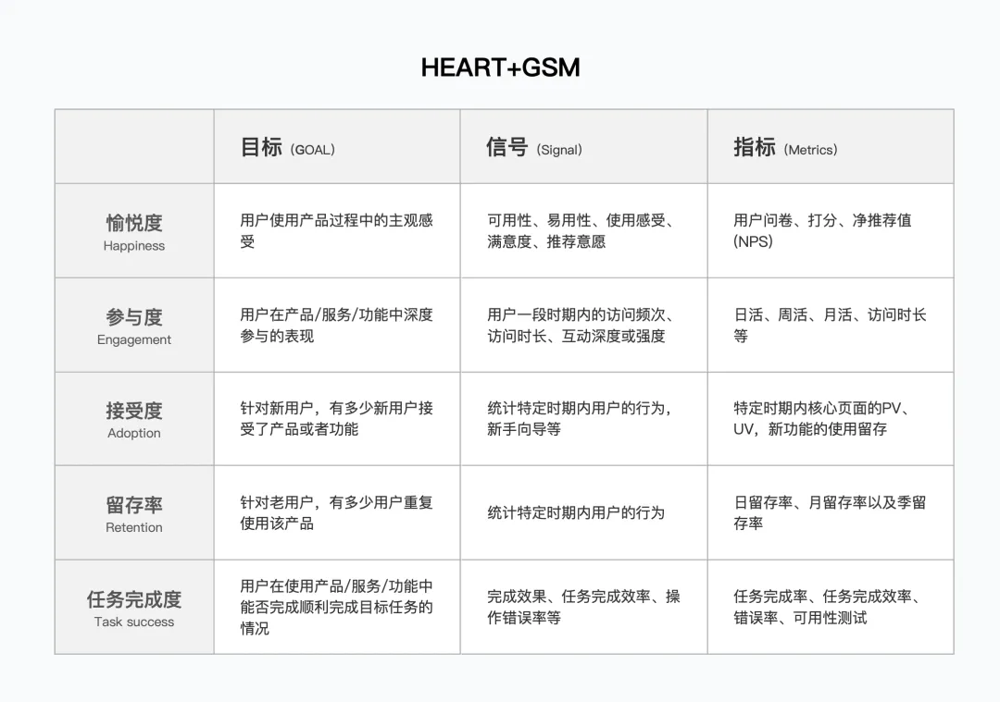 | Google |
| **PETCH** | 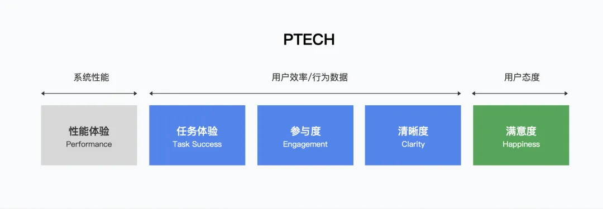 | — | 支付宝 |
| **两章一分** | 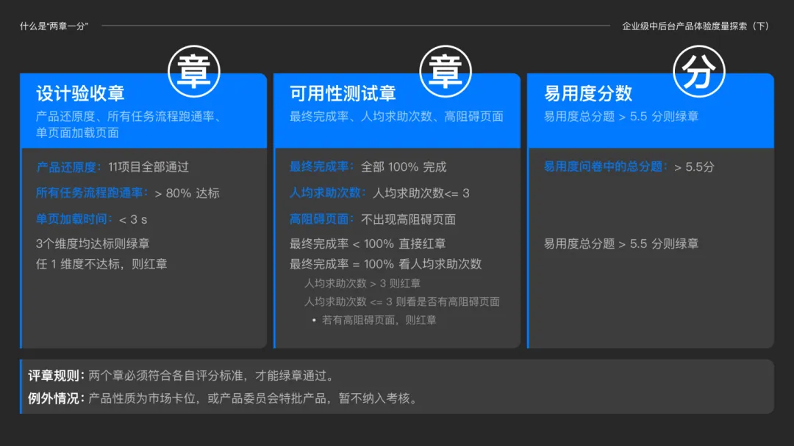 | — | 支付宝 |
| **UES** | 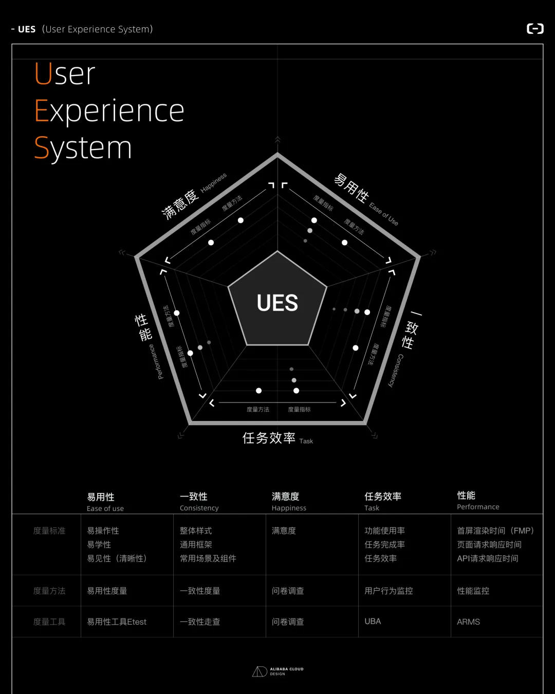 | 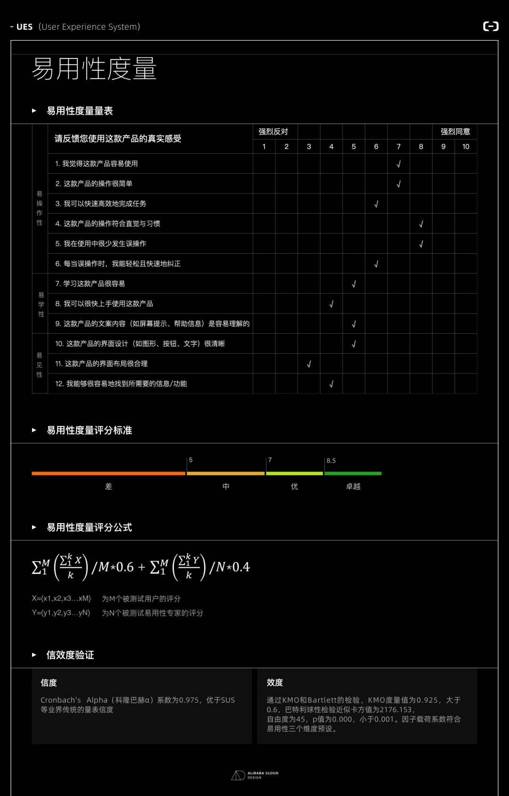 | 阿里云 |
| **DES** | 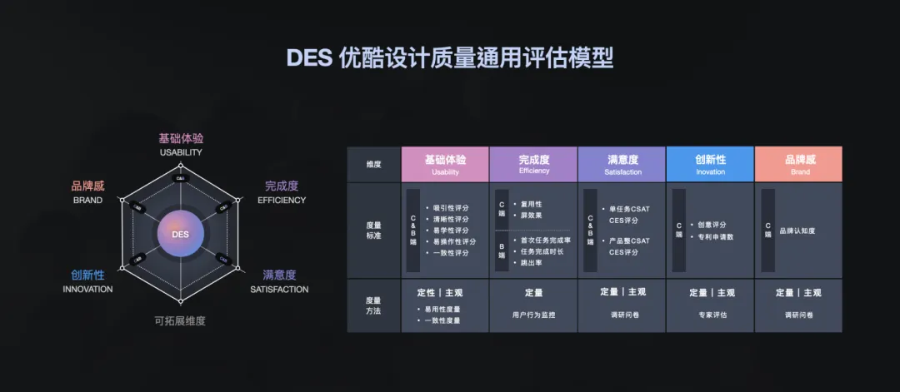 | 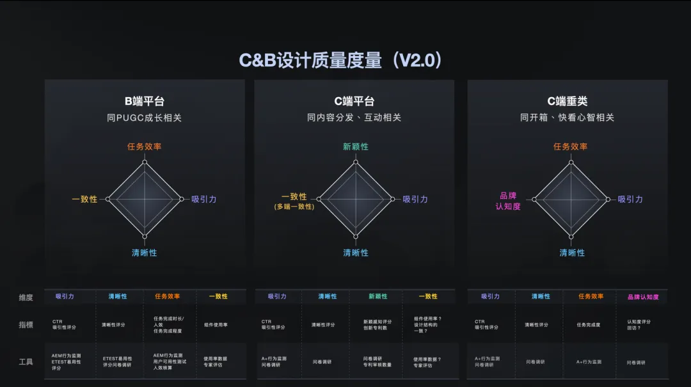 | 优酷 |

## 来源与参考

- 原文：神灯圈子·王仰龙《B端系统体验度量OnePage》 http://xingyun.jd.com/shendeng/article/detail/52413（Joyspace 镜像 https://joyspace.jd.com/pages/OVrKVjTmc9ThLkN3NGDN）
- [体验度量](https://mp.weixin.qq.com/s/zSrssvGrGmtAXd5GulB_pg)
- [体验度量专题｜通过200+产品设计实践给产品体验探索一个好用标准](https://mp.weixin.qq.com/s/jDRxcqYgUudS4WREyDFS5Q)
- [产品使用体验如何量化与管理——阿里云 UES 全面揭秘](https://mp.weixin.qq.com/s/9LJXsdXL54BzyuKcMjo8KA)
- [体验度量专题｜易用度在企业级中后台产品的探索和实践](https://mp.weixin.qq.com/s/sX9SauijjXfQ6bOcJaCluQ)
- [6000字分析+案例，带你弄懂B端产品体验度量](https://mp.weixin.qq.com/s/mXFonWYPDs9ya_qMN4OvTQ)
- [体验设计度量，看这一篇就够了（上篇）](https://mp.weixin.qq.com/s/UDNeOcp--7-n66-rKj2dwg)
- [云计算软件产品使用体验质量 度量模型及度量方法](https://www.ttbz.org.cn/upload/file/20191207/6371128220196543386097977.pdf)
- [如何计算最少样本量](https://jelly.jd.com/article/6268b4a08acc790195e053e2)
- [A comparison of psychometric properties and normality in 4-, 5-, 6-, and 11-point Likert scales](https://joyspace.jd.com/attachment-preview/pages/zgOQ1ME5EIskEk0nftlq/kKtWBU3mC9Cffhwf2hWU)
- [思考：客户满意度(CSAT)和净满意度(NSS)区别在哪？](https://mp.weixin.qq.com/s/BVyhK-8f8ua1sEAGxlHDFA)
- 神灯圈子·江竹《体验度量经验分享：如何沟通共识?》（原作者明玥、子萌，2022.07.10）http://xingyun.jd.com/shendeng/article/detail/46478
- 神灯圈子·徐凯《关于体验管理的几点思考》（2022.04.14）http://xingyun.jd.com/shendeng/article/detail/46482
- 神灯圈子·吉国杰《体验监测管理体系的构建思路分享》（原作者徐凯，2021.12.14）http://xingyun.jd.com/shendeng/article/detail/46501

## 关联

- `methods/toolbox/analysis/experience-metrics-heart.md`
- `methods/toolbox/collection/satisfaction-survey.md`
- `methods/toolbox/analysis/satisfaction-drop-attribution.md`
- `methods/toolbox/analysis/ab-testing.md`
- `assets/scales/standardized-ux-scales.md`
