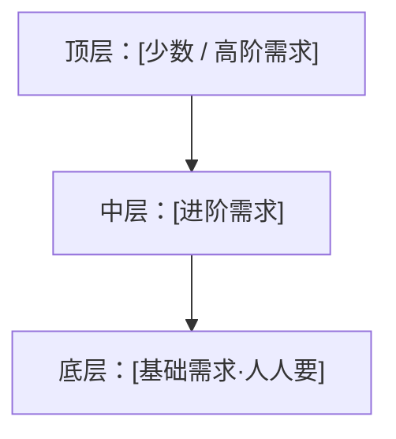
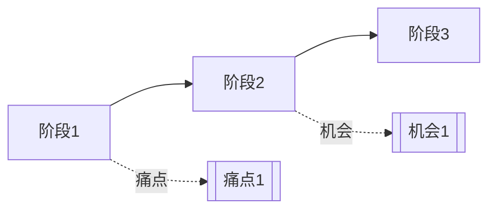
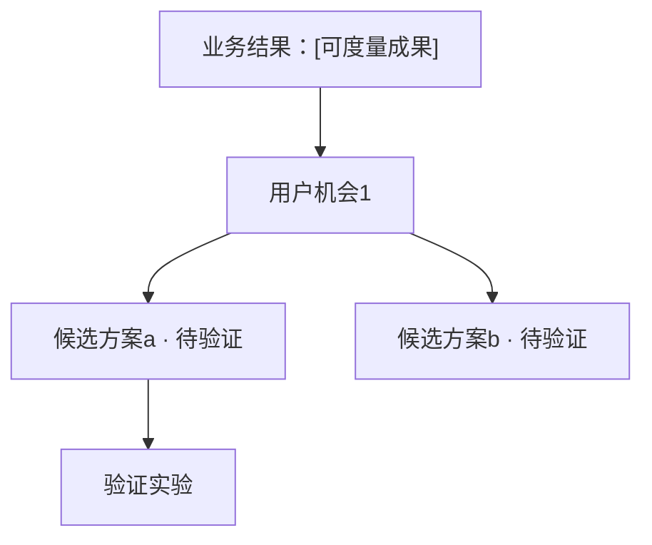

# 交付稿（正文）+ 可视化 + 落地桥 · 输出骨架与模板

> 本文件是 **synthesize-qualitative-insights skill 自己的产出结构**，不是 wiki 正典。
> **定位（两态之一）**：这里是**交付稿（给业务/干系人看的正文）**及其**可视化**、**落地桥**的结构。与之配对的**分析底稿（保留方法论痕迹的后置附录）**结构见 `synthesis-skeleton.md`。
> 组织原则（结论先行 / SCQA / 六股 / 论点配论据）来自 `pyramid-principle`、`research-report-writing`；落地桥来自 `opportunity-solution-tree`、`continuous-discovery`——**一律运行时从 `research-wiki/` 现读**，此处只给"长什么样"的空骨架。
> 方括号 `[…]` 是占位槽。匿名化原则见 SKILL.md「敏感素材处理」。

---

## 一、交付稿骨架（按研究问题组织、结论先行）

交付稿给业务/干系人拍板用，**不是分析过程的复述**。两条硬规则：

**① 先剥方法论——正文里不出现这些词：**
亲和图 / 便签 / level1·level2 / "频次 4/6" / D·Q / 结果→结论→洞察 / 洞察定义五要素 / 框架名（用户旅程地图·价值主张画布·同理心地图·ABC）。
- 频次照样表达，但说「6 位受访里有 4 位……」，而不是「该 level-2 主题频次 4/6、标 Q」。
- 框架照样用来分析，但结论里只留**结论本身**，不写「我们用价值主张画布得出……」。

**② 按用户的研究问题组织、每条结论先行：**

```
# [研究主题] · 洞察交付（可迭代初稿）

> 一句话总结论（整份报告的中心思想，先行）：[……]

## 研究问题 1：[用用户的原始问题措辞，如「老会员为什么流失、怎么挽留」]
  结论：[结论先行的一句话——直接回答这个问题]
  依据：
    - [数据 / 观察，如「6 位里 4 位提到运费券价值缩水」]
    - "[匿名原话]" —— [代称]
  （如适用）边界：[这条结论不适用 / 不建议硬推的情形]

## 研究问题 2：[……]
  结论：[……]
  依据：[……]

## 总结论 / 主线
  [把各问题的结论串成一条线：可按用户流程，或拉新-留存-促活等业务线]
```

**③ 主线自检**：只读各段标题能否把故事讲通？（`pyramid-principle`：只看标题就懂。）

---

## 二、一页纸摘要模板（结论先行；交付物偏长时必给）

```
# [主题] · 一页纸

- **核心结论**：[一句话]
- **关键发现（3–5 条，每条一行、结论先行）**：
  1. [发现 + 最强论据一句]
  2. …
- **建议 / 下一步**（若有落地桥）：[1–3 条，标"待验证"]
- **不该做**：[负向边界一句]
- 详版见下 / 附件。
```

---

## 三、可汇报 PPT 大纲（套 research-report-writing 六股，markdown）

> 本 skill 只出**大纲（markdown）**；真正的 `.pptx` 交给 `anthropic-skills:pptx` 或用户（见第六节交接）。

```
1. 封面：[主题 / 时间 / 团队]
2. 项目背景（1 页）：[需求从哪来]
3. 执行概要（1 页）：[做了什么——方法/样本一句带过，不展开方法论]
4. 研究内容（1 页）：[研究问题清单]
5. 主体（每页一个研究问题 / 一个结论，结论先行 + 论据图/原话）：
   - 页 5.1：研究问题 1 → 结论 + 论据
   - 页 5.2：…
   -（如有分层结论）单开一页放阶梯 / 金字塔示意图
6. 整体结论 / 策略建议（1–3 页）：主线 +（可选）落地建议（标待验证）
7. 附录：方法与样本、分析底稿、《本次运行说明》
```

---

## 四、结论示意图形态库（Mermaid / ASCII，**纯形态示意，勿照抄**）

按结论形状选一种；下面是格式演示，内容务必按真实结论重写。

**① 阶梯 / 进阶（分层洞察最常用）—— ASCII：**

```
   L3  │ [第3层名]：[一句定义]  │  ← 目标层
       ├────────────────────────┤
   L2  │ [第2层名]：[一句定义]  │  ← 多数用户当前在此
       ├────────────────────────┤
   L1  │ [第1层名]：[一句定义]  │  ← 起点
```

**② 金字塔 / 需求分层 —— Mermaid：**



**③ 象限（如 重要性 × 满意度 / 价值 × 成本）—— ASCII：**

```
        高价值 ↑
   [象限2 重点改] │ [象限1 保持优势]
   ───────────────┼─────────────── → 表现好
   [象限3 低优先] │ [象限4 过度投入]
```

**④ 流程 / 旅程（阶段 + 痛点 + 机会）—— Mermaid：**



**⑤ OST 落地树 —— Mermaid（详见第五节）：**



---

## 五、落地建议桥骨架（OST，**仅第 5 步触发时**）

编排 `opportunity-solution-tree` + `continuous-discovery`。**候选方案 / 命名 / 信息架构一律标"待验证假设"。**

```
## 落地桥（OST）

  业务结果（根）：[本阶段锚定的可度量成果]

  用户机会 1（干）：[从洞察浮现的机会——挂回哪条洞察/主题]
    候选方案 a（枝，⚠️待验证假设）：[产品 / 设计改动设想]
        验证实验（叶）：[怎么小步验证——原型测试 / 灰度 / A-B / 命名测评]
    候选方案 b（枝，⚠️待验证假设）：[…]
  用户机会 2（干）：[…]

  （如要排序）优先级：[KANO 滤掉无差异/反向型 → 四象限四维打分的结果]
  （如要命名）候选名测评：[六原则符合度 + 测评四法结论，从候选里选优；仍待验证]

  > 全段标注：这些是设计假设、非研究结论，需验证后才能当决策依据。
```

---

## 六、跨交付物风格一致 + 交接

- **一致性清单**（有多个交付物时逐项对齐）：
  - [ ] 同一套**结论措辞**——一句话总结论在正文 / 一页纸 / PPT 里一字不差
  - [ ] 同一套**层级 / 主题命名**——阶梯层名、研究问题措辞不换词
  - [ ] 同一套**数字口径**——"6 位里 4 位"处处一致，别一处写人数一处写占比
  - [ ] 视觉风格统一——若复用产品截图 / 配色，全套沿用同一套
- **真 `.pptx` / 图片交接**：本 skill 出 markdown 大纲 + Mermaid/ASCII 示意；要成品 PPT / 图片时，把大纲与示意交给 `anthropic-skills:pptx`（或用户），并说明"配色、页数、层级已在大纲里标注，按此生成"。
